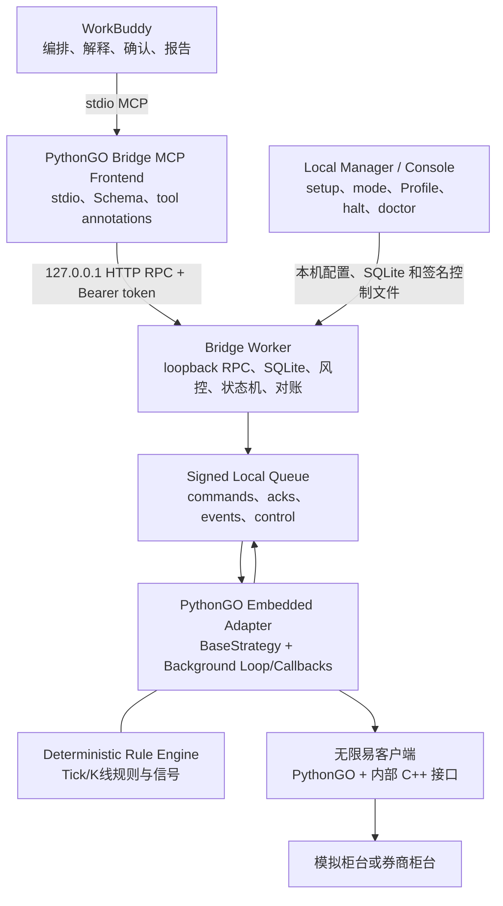
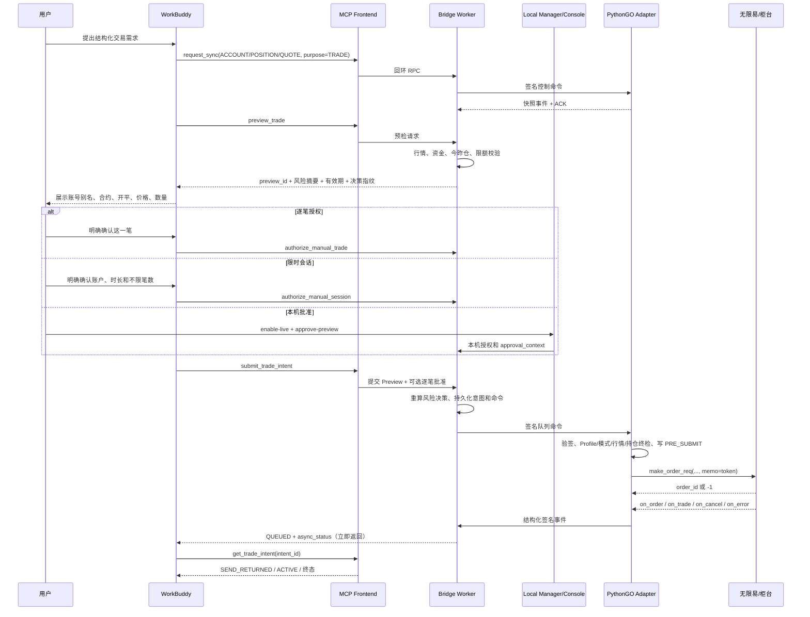

# WorkBuddy 与无限易（PythonGO）桥接程序设计

> 状态：Design v0.3.7（对齐 WorkBuddy-QMT Bridge 0.3.0 的 `LIMITED_AUTO` 安全模型）
> 日期：2026-08-27  
> 适用范围：Windows、Tencent WorkBuddy、无限易客户端、PythonGO v2、期货行情监控及模拟/实盘交易  
> 风险声明：本文描述交易基础设施，不构成投资建议。任何实盘能力必须经过只读、空跑、模拟、人工确认和小额灰度验证。

## 1. 文档目的

建设一个受控的 **WorkBuddy–InfiniTrader PythonGO Bridge**，使 WorkBuddy 可以通过 MCP：

- 查询无限易与 PythonGO Adapter 的运行状态；
- 获取合约、Tick、K 线、资金、持仓、委托和成交的结构化快照；
- 管理确定性的行情监控规则并读取持久化信号；
- 将结构化信号转换为可审计的交易意图；
- 完成预检、人工批准、硬风控、报单、撤单、回报跟踪和异常恢复；
- 输出结构化执行事实，而不是根据控制台日志或自然语言猜测交易结果。

本设计以同级项目 **WorkBuddy-QMT Bridge 0.3.0** 的发布包、源码预览和配置示例为可移植基线。可复用部分包括 stdio MCP 前端、仅回环 Worker、Bearer 令牌、严格 JSON 配置、SQLite、HMAC 文件队列、四种运行模式、独立熔断、签名 Profile、二阶段风险指纹、人工授权、P1 结构化自动许可和 `doctor` 诊断；PythonGO 特有部分包括客户端内生命周期、`BaseStrategy` 回调、报撤单线程亲和性、期货今昨仓、跨午夜夜盘、`memo` 关联以及客户端重启后的保守对账。

PythonGO 是无限易客户端内置能力，策略必须加载到无限易中执行，因此不能套用 TqSdk 的外部常驻 `TqApi` 架构。系统需要在无限易客户端中运行一个轻量 **PythonGO Embedded Adapter**，再由客户端外部的 **Bridge Worker** 承接 MCP 请求、数据库、审批、风控、命令投递和事件入库。

v0.3 在 v0.2 的 P0 基线上增加 P1 `LIMITED_AUTO`：结构化许可、代次轮换、策略版本绑定、期货夜盘时间窗、子委托级原子预算、Worker/Adapter 双重独立校验、本地自动暂停和启动/切模/熔断撤销。该能力的代码存在不等于运行实例已经获准进入自动模式；未签名 Profile、熔断、旧 Adapter、陈旧快照或未完成对账仍会失败关闭。

## 2. 关键结论

### 2.1 WorkBuddy 不直接调用 PythonGO

WorkBuddy 只调用语义受限的 MCP 工具，例如：

- `get_quote_snapshot`；
- `get_pending_signals`；
- `get_account_snapshot`；
- `preview_trade`；
- `submit_trade_intent`；
- `cancel_order`。

不得向 WorkBuddy 暴露任意 Python、任意 PythonGO 函数名、原始 `INFINIGO` 调用或未经白名单验证的枚举值。

### 2.2 外部 Worker 与内嵌 Adapter 分离

系统采用四个组件：

- **PythonGO Bridge MCP Frontend**：WorkBuddy 启动的轻量 stdio MCP 进程，只做 Schema、注解、Bearer 认证和转发；
- **PythonGO Bridge Worker**：只监听数字形式本机回环地址的常驻进程，维护 SQLite、审批、风险、命令和对账；
- **PythonGO Embedded Adapter**：继承 `BaseStrategy`，加载到无限易客户端运行；
- **Local Manager / Console**：首次配置、模式选择、Profile 签名、状态、诊断、熔断恢复和人工处置入口。

MCP 前端重启不能影响已有订单回报。Worker 重启不能导致 Adapter 重复报单。无限易关闭时，Adapter 必然停止，因此系统必须把“客户端在线”和“外部服务在线”分开监控。

### 2.3 PythonGO 是客户端生命周期的一部分

官方文档说明，PythonGO 基于无限易内部 C++ 接口封装，策略需要加载到无限易客户端执行；无限易关闭后 PythonGO 策略也会停止。系统不能把 PythonGO Adapter 当作独立守护进程，也不能承诺客户端退出后仍能继续接收柜台回报。

因此：

- 无限易客户端必须由专用 Windows 会话运行；
- 禁止自动将“客户端进程存在”等同于“交易会话可用”；
- Adapter 必须持续发送心跳、策略实例状态和回调时间；
- 客户端或 Adapter 中断后，账户进入 `RECONCILIATION_REQUIRED`；
- 恢复完成前禁止自动报单。

### 2.4 订单和成交回调才是执行事实

PythonGO 的报单函数返回本地报单编号，`-1` 表示立即失败；正数只表示获得报单编号，不代表交易所已受理，更不代表成交。撤单函数返回 `0` 只表示撤单请求发送成功，仍要等待 `on_cancel`、`on_order` 或 `on_error`。

系统以以下回调作为事实来源：

- `on_order(OrderData)`：委托变化；
- `on_trade(TradeData)`：成交；
- `on_cancel(CancelOrderData)`：撤单回报；
- `on_error(error)`：报单、撤单或策略运行错误；
- `on_contract_status(status)`：合约状态变化。

`on_order_trade` 与 `on_trade` 含义重叠，桥接只消费 `on_trade`，避免重复成交事件。

### 2.5 报单幂等只能做到保守的“效果至多一次尝试”

PythonGO 报单编号由平台返回，接口没有暴露由调用方指定确定性订单号的能力。系统只能：

- 在调用报单前持久化意图和 `PRE_SUBMIT` 日记；
- 使用短、确定性的 `memo` 关联意图；
- 调用后立即持久化返回的 `order_id`；
- 用委托和成交回调中的 `memo` / `order_id` 对账；
- 对崩溃窗口进入 `SUBMIT_UNKNOWN`，永不自动重发。

不能宣称跨客户端、网络、柜台严格“恰好一次”。

### 2.6 审计型桥接不直接使用 `auto_close_position()`

官方文档说明，当上期所或能源中心同时需要平今和平昨时，`auto_close_position()` 可能发出多个订单，但只返回最后一个报单编号。这会破坏一笔意图到全部子订单的完整追踪。

因此桥接使用 `make_order_req()` 或经过兼容性验证的底层明确开平接口，将今仓和昨仓拆成独立子订单，并分别记录订单号。`auto_close_position()` 可以保留给普通策略，但不进入桥接实盘执行路径。

### 2.7 与 QMT 基线的继承和差异

| 设计面 | 直接继承 QMT 基线 | PythonGO 必须特化 |
| --- | --- | --- |
| 进程边界 | stdio MCP → 回环 Worker → 签名文件队列 → Embedded Adapter | Adapter 继承 `BaseStrategy` 并随无限易启停 |
| 本机安全 | Worker token、HMAC、TTL、严格 Schema、原子写、dead letter | 账号绑定使用显式 `investor` 与指纹，不能依赖第一个登录账号 |
| 能力开放 | P0 Profile 验证、绑定、签名后才开放非观察模式 | Profile 记录 PythonGO/无限易/柜台构建、开平映射、状态映射、memo 和调度验证结果 |
| 模式 | 四种统一运行模式，熔断是独立状态 | `OBSERVE_ONLY` 在 Adapter 内完成空跑 ACK；模拟/实盘仍由柜台和本机配置共同判定 |
| 二阶段交易 | 同步 → Preview → 授权 → Submit 重验 → 签名命令 | 平仓意图可能确定性拆为今仓/昨仓子订单 |
| 防重复 | 本地 `client_order_key`、执行日记、`SUBMIT_UNKNOWN` 不重发 | 还需用 `memo`、PythonGO `order_id` 和回调事实对账 |
| 最终风控 | Worker 与 Adapter 双重校验 | Adapter 必须重验交易时段、合约、tick、今昨可平量、保证金和风险度 |

## 3. 官方能力与约束依据

### 3.1 PythonGO 运行模型

PythonGO v2 使用 `BaseStrategy` 作为基础策略类。主要生命周期和回调包括：

- `on_init()`：创建或加载实例；
- `on_start()`：点击运行后启动，设置 `trading=True` 并订阅行情；
- `on_stop()`：点击暂停后执行，设置 `trading=False`、保存实例并取消订阅；
- `on_tick()`：Tick 行情推送；
- `on_order()`、`on_trade()`、`on_cancel()`、`on_error()`：交易回报；
- `on_contract_status()`：交易状态变化。

参考：

- [PythonGO 运行原理](https://infinitrader.quantdo.com.cn/pythongo_v2/tutorial/how_it_works)
- [pythongo.base / BaseStrategy](https://infinitrader.quantdo.com.cn/pythongo_v2/modules/pythongo_base)

### 3.2 行情与账户 API

官方文档提供：

- `sub_market_data()` / `unsub_market_data()`；
- `TickData` 一至五档、涨跌停、成交量、持仓量和更新时间；
- `MarketCenter.get_kline_data()`、交易时段和主连列表查询；
- `get_account_fund_data(investor)`；
- `get_position(..., investor=..., simple=...)`；
- `get_all_position(simple=...)`；
- `get_instrument_data()` / `get_instruments_by_product()`。

`MarketCenter` 数据接口有调用限制，官方明确要求避免有规律的高频调用；`get_kline_data()` 单次按数量查询最大 1440 根。桥接不能把该接口当作持续轮询行情源。

参考：

- [pythongo.core / MarketCenter](https://infinitrader.quantdo.com.cn/pythongo_v2/modules/pythongo_core)
- [TickData](https://infinitrader.quantdo.com.cn/pythongo_v2/modules/pythongo_classdef/tick)
- [Position](https://infinitrader.quantdo.com.cn/pythongo_v2/modules/pythongo_classdef/position)

### 3.3 交易 API

桥接用到的公开能力包括：

- `send_order()`：基础开仓报单；
- `make_order_req()`：显式指定方向、开平、报单指令、账户和套保标志；
- `cancel_order(order_id)`：精确撤单；
- `OrderData`、`TradeData`、`CancelOrderData` 回报对象；
- `memo`：订单和成交中可回传的备注字段。

参考：

- [pythongo.base / 报撤单函数](https://infinitrader.quantdo.com.cn/pythongo_v2/modules/pythongo_base)
- [OrderData](https://infinitrader.quantdo.com.cn/pythongo_v2/modules/pythongo_classdef/order)
- [TradeData](https://infinitrader.quantdo.com.cn/pythongo_v2/modules/pythongo_classdef/trade)
- [PythonGO 数值映射](https://infinitrader.quantdo.com.cn/pythongo_v2/faq/mapping)

### 3.4 版本原则

PythonGO v2 与旧版接口差异较大。v2 使用下划线回调命名、`BaseStrategy`、`send_order` / `make_order_req` 和 `Scheduler`；旧版 `regTimer` 等能力已经迁移或弃用。

`BaseStrategy` 的导入属于 Adapter 启动的硬依赖；`MarketCenter` / `KLineStyle` 仅属于 K 线能力的可选依赖，必须使用独立导入边界。可选 K 线组件失败不得导致 Adapter 静默改用离线测试桩，否则会形成没有账户、持仓和交易 API 的“假 READY”。真实 `BaseStrategy` 缺失时必须失败关闭。

当前官方更新日志包含 2026 年版本，并记录了多个与交易安全相关的修复，例如：

- `on_cancel` 新回调；
- 简化实时持仓；
- 全账户持仓查询；
- 过长 `memo` 的稳定性修复；
- `trading=False` 时不处理撤单；
- Python 3.12 与 venv 支持。

部署必须锁定：

- 无限易客户端完整版本；
- PythonGO v2 完整版本；
- Python 版本与位数；
- 虚拟环境和依赖哈希；
- 券商、柜台和行情权限。

参考：[PythonGO v2 更新日志](https://infinitrader.quantdo.com.cn/pythongo_v2/changelog)和[迁移指南](https://infinitrader.quantdo.com.cn/pythongo_v2/v1_to_v2)。

## 4. 范围与非目标

### 4.1 首期范围

- 单台 Windows 主机、一个无限易客户端实例；
- PythonGO v2，不兼容旧版策略接口；
- 一个或多个期货投资者账号别名；
- 每个账号别名对应独立 Adapter 实例或严格隔离的队列分区；
- 期货 Tick、有限 K 线、合约与交易时段查询；
- 资金、持仓、桥接委托与成交查询；
- 版本化行情规则、信号去重和信号查询；
- 期货限价开仓、平仓、平今、平昨；
- 单笔精确撤单；
- 只读、空跑、模拟和人工批准实盘模式；
- SQLite 审计、签名本地队列、本机控制台；
- WorkBuddy 查询、解释、确认、报告与通知。

### 4.2 延后范围

- 期权、组合、套利组合单和行权；
- 证券、股票期权、金交所、港股等交易；
- FAK、FOK、市价、最优价和五档价报单；
- 自动追单、TWAP、VWAP、冰山等算法执行；
- 多客户端、跨主机高可用；
- 跨账号原子交易；
- 批量全撤、全平；
- 无人工审核的开放式自然语言实盘交易；
- Tick 到报单的确定性低延迟 SLA。

### 4.3 明确非目标

- 不允许 WorkBuddy 传入任意代码或动态模块；
- 不直接调用未公开、未固定版本的 `INFINIGO` 原始函数；
- 不把日志文本当作委托或成交事实；
- 不把正数 `order_id` 解释为已成交；
- 不把撤单返回 `0` 解释为已撤；
- 不把 `pause_strategy()` 当作紧急撤单机制；
- 不依赖 `auto_close_position()` 追踪拆分平仓订单；
- 不用大模型决定最终可平量、保证金和风险度；
- 不在 WorkBuddy、MCP 参数或日志中保存投资者账号和密码。

## 5. 总体架构



### 5.1 为什么不在 PythonGO 内启动 MCP Server

PythonGO 依赖无限易客户端生命周期和事件回调。将 MCP、Web 服务、数据库迁移、认证和大模型依赖塞进策略进程，会扩大客户端崩溃面，并可能阻塞行情与交易回调。

Embedded Adapter 只负责：

- 轮询已持久化的受限命令；
- 本地最终校验；
- 调用 PythonGO 报撤单函数；
- 接收交易与行情回调；
- 输出结构化事件、快照、心跳和本地执行日记。

### 5.2 组件职责

| 组件 | 主要职责 | 禁止承担 |
| --- | --- | --- |
| WorkBuddy | 自然语言、编排、确认、报告、通知 | Tick 循环、凭据、最终硬风控 |
| MCP Frontend | Schema、工具安全注解、读取本机 Worker token、请求转发、响应裁剪 | 直接访问 PythonGO、持有交易状态、切换模式 |
| Worker | 回环 RPC、数据库、审批、风控、意图、签名命令、读模型、对账 | 在无限易外调用 PythonGO、监听非回环地址 |
| Embedded Adapter | PythonGO 生命周期、报撤单、回调、账户和行情快照 | 大模型推理、远程服务、开放式代码执行 |
| Rule Engine | 确定性行情计算和信号 | 越过审批直接报单 |
| Local Manager / Console | 安装、配置、模式、Profile 签名、可选本机逐笔批准、解除熔断、诊断 | 对公网开放、绕过 P0 或硬风控 |

## 6. 信任边界与安全原则

| 数据或动作 | 权威来源 | WorkBuddy 权限 |
| --- | --- | --- |
| Tick/合约状态 | PythonGO 回调 | 只读 |
| 历史 K 线 | 受限 MarketCenter 查询或本地合成缓存 | 只读 |
| 资金与持仓 | PythonGO 账户/持仓 API 快照 | 只读 |
| 委托与成交 | `on_order` / `on_trade` / `on_cancel` / `on_error` | 只读 |
| 交易预检 | Worker + Adapter 最新快照 | 发起 |
| 人工实盘授权 | 本机 Console，或 MCP 高风险授权工具在用户明确确认后写入的短时授权 | 可创建逐笔授权或 1–60 分钟账户级授权；不可切换模式 |
| 报撤单 | Embedded Adapter | 只能提交受限意图 |
| 模式切换/解除熔断/Profile 签名 | Local Manager / Console | 禁止 |

安全基线：

- 默认 `OBSERVE_ONLY`，未知旧模式只允许在受控迁移中映射为观察模式；
- 熔断是独立布尔安全状态，不是第五种运行模式；解除后强制回到 `OBSERVE_ONLY`；
- 模式、Worker 请求和 Adapter 配置必须完全一致；任何不一致都失败关闭；
- 客户端或 Adapter 重启后，旧的短时 LIVE 授权、逐笔批准和限时会话不得自动恢复；
- WorkBuddy 可以触发 `halt_trading`，不能触发 `resume_trading`；
- `authorize_manual_trade` 和 `authorize_manual_session` 必须标记 `destructiveHint=true`，只在本机已经切到 `MANUAL_LIVE` 后生效；
- 券商密码、登录凭据和客户端会话由无限易管理，不进入任何桥接配置；
- Worker 只保存账户别名和不可逆账号指纹；真实 `investor` 只存在于无限易和受 ACL 保护的 Adapter 本机配置；
- Worker 只监听 `127.0.0.1` 或 `::1` 的数字地址，拒绝主机名、局域网和公网绑定；
- MCP Frontend 从本机密钥文件读取至少 32 字符的 Worker token，token 不写入 WorkBuddy MCP JSON；
- HMAC keyring 每把密钥至少 256 bit，信封携带 `key_id`；轮换时先加入新键并切换 `active_key_id`，待旧队列排空和 Profile 重签后再移除旧键；
- Adapter 命令使用 HMAC 签名、有效期、唯一消息 ID、执行键和重放保护；
- Adapter 只接受白名单命令类型和字段；
- 配置、消息和 Profile 都拒绝未知字段、非有限数字和宽松类型转换；
- 单条 RPC 与队列消息受统一大小上限约束；
- 所有副作用意图必须先持久化再投递。

## 7. 账号与策略实例模型

### 7.1 显式投资者账号

PythonGO 部分函数的 `investor` 参数为空时会使用查询到的第一个账号。桥接不得使用该默认行为。

每个交易、资金或持仓调用都必须绑定：

```text
client_alias + strategy_instance_alias + investor_alias
```

Adapter 启动时：

1. 从受 ACL 保护的 Adapter 配置读取显式 `investor_id`，从 Worker 配置和签名 Profile 读取已批准指纹；
2. 调用投资者信息查询并确认该账号确实存在于当前登录会话；
3. 将配置和查询得到的实际 `investor_id` 按版本化规范计算为指纹；
4. 与 Worker 配置和 Profile 中的指纹比较；
5. 任一不一致则进入 `ACCOUNT_BINDING_MISMATCH` 并禁止交易。

账号指纹不能直接使用低熵账号的裸 SHA-256。采用带版本和域分离的 `HMAC-SHA256(binding_key, "pythongo-investor-v1\0" + normalized_investor_id)`；`binding_key` 只保存在本机 secrets 中。日志和 MCP 仅返回短前缀用于诊断，不返回完整指纹。

本机修改已有账号绑定时必须先写入耐久 `ACCOUNT_CHANGE` 保护并立即把旧 Profile 置为未验证，再按 Profile、Adapter 配置、Worker 配置的顺序原子替换。但首次从占位符绑定账号时没有可失效的旧交易证据，应写 `SETUP_LOCK` 并保持数据库全局熔断为 false，使界面表达为“交易尚未启用”而不是事故；Adapter 本地交易锁仍保持 true。重复输入与 Worker 和 Adapter 已批准指纹完全一致的账号必须是幂等无操作，不得作废 Profile 或改变保护状态。完成 P0、重签和诊断后才可由本机 Console 使用 `CLEAR-HALT` 恢复到 `OBSERVE_ONLY`；中途崩溃不得继续沿用旧绑定证据。

### 7.2 推荐一账号一 Adapter 实例

即使一个无限易客户端登录多个投资者账号，也推荐每个账号创建一个独立 PythonGO Adapter 实例：

- 命令队列和订单状态隔离；
- `strategy_id` 和 `strategy_name` 可追踪；
- 避免遗漏 `investor` 导致错账号；
- 独立限额与熔断；
- 故障处置更清晰。

若使用一个 Adapter 服务多个账号，所有调用都必须显式传 `investor`，并通过专项测试证明不会串号。

### 7.3 策略实例身份

Adapter 事件至少包含：

- `client_alias`；
- `strategy_id`；
- `strategy_name`；
- `adapter_instance_id`；
- `investor_alias`；
- `investor_fingerprint`；
- PythonGO 与桥接协议版本。

`strategy_id` 由无限易自动分配，不能作为跨重启的唯一业务主键。`adapter_instance_id` 由桥接配置稳定生成。

### 7.4 P0 绑定 Profile

参考 QMT Bridge，安装向导为每个账户生成未验证、未签名的 `pythongo_profile.json`。Profile 不是普通配置，而是“这台电脑、这个无限易/PythonGO 构建、这个柜台、这个 Adapter 实例已经完成哪些兼容性验证”的机器可读证据。未满足以下全部条件时，Adapter 只能运行 `OBSERVE_ONLY`：

- `verified=true`；
- `profile_id`、`infinitrader_build`、`pythongo_build`、`broker_build` 均来自 P0 证据且无占位符；
- Profile、`pythongo_adapter.json` 和 `bridge.json` 的账户别名、账号指纹、Adapter 实例和策略名一致；
- `expected_profile_id` 和三个构建标识逐字一致；
- `mappings` 只包含现场验证过的方向、开平、报单类型、状态和错误映射；
- 调度模式、`memo` 安全长度、回调字段和重启行为均有验证结论；
- Profile 使用本机消息密钥签名，且签名验证成功。

建议 Schema：

```json
{
  "protocol_version": "1.0",
  "profile_id": "REPLACE_AFTER_P0",
  "infinitrader_build": "REPLACE_AFTER_P0",
  "pythongo_build": "REPLACE_AFTER_P0",
  "broker_build": "REPLACE_AFTER_P0",
  "account_type": "FUTURES",
  "strategy_name": "WorkBuddyPythonGO",
  "adapter_binding": {
    "account_alias": "main_futures",
    "account_type": "FUTURES",
    "adapter_instance": "pythongo_futures_01",
    "investor_fingerprint": "hmac-sha256:v1:REPLACE_AFTER_P0",
    "strategy_name": "WorkBuddyPythonGO"
  },
  "verified": false,
  "capabilities": {
    "dispatch_mode": "TICK_DISPATCH",
    "memo_max_bytes": 0,
    "explicit_close_yesterday": false,
    "order_trade_replay_after_restart": false
  },
  "mappings": {},
  "key_id": "bridge-local-01",
  "signature": ""
}
```

`mappings` 的键建议采用 `FUTURES:<ACTION>:LIMIT:GFD`，值保存目标版本实际接受的 `order_direction`、`offset`、`order_type`、`hedgeflag` 和 `market`。发布包不得预签 Profile；示例中即使预填公开文档候选值，也必须保持 `verified=false`。签名必须是最后一步，签名后修改任何字段都必须重新核对并重签。旧电脑、旧账号、旧无限易/PythonGO 构建或旧柜台的 Profile 不得复用。

具备本机文件和命令行权限的 AI Agent 可以在操作者提供并确认 P0 证据后，机械地填写 Profile、同步 Adapter 的 `expected_*`、调用本机签名命令并运行 `doctor`；它不能自行猜测柜台构建、方向/开平枚举、线程模型或回调字段，也不得输出完整账号、Worker token、消息密钥或签名内容。

P0 报撤单探针是唯一例外性的兼容性取证通道，但仍不得绕开本地控制：它只存在于 Local Console，不进入 MCP；要求操作者精确确认、Worker 和 Adapter 均为 `OBSERVE_ONLY`、Adapter 本地交易锁仍开启、账户与 Adapter 绑定一致、行情/资金快照新鲜、硬风险阈值通过。Console 写入最长 30 秒的一次性签名授权，命令固定为 1 手、实时跌停价、`BUY/0/GFD/1/market=false` 候选映射；Adapter 在 Tick 主线程消费授权并写 `PRE_SUBMIT` 日记，获得非负本地报单号后立即调用精确撤单。现场 P0 已确认目标 PythonGO 构建的首个有效本地委托号可以是 `0`，`-1` 才表示报单前失败，`None` 或异常保持 `SUBMIT_UNKNOWN`。该通道产生的入参、返回值和原始回调仅作为 P0 候选证据，在操作者复核前不得写成已验证 Profile。若操作者对实际合约另行批准单次隔离名义金额额度，额度必须为正且不超过 100 万元，并与精确交易所、合约月份一起进入签名命令和命令哈希，由 Worker 与 Adapter 双重校验，同时使用 20% 保守保证金门禁；不得修改或替代账户常规 `max_order_notional`。源码不预先批准任何固定合约或固定隔离金额。

## 8. Embedded Adapter 生命周期

### 8.1 基础类

首版 Adapter 基于 PythonGO v2：

```python
from pythongo.base import BaseParams, BaseState, BaseStrategy, Field


class WorkBuddyBridgeAdapter(BaseStrategy):
    """WorkBuddy 与无限易之间的受控桥接适配器。"""
```

类名必须与策略文件名一致，按无限易策略管理流程加载。Adapter 参数通过 `BaseParams` 展示，运行状态通过 `BaseState` 展示。

### 8.2 回调职责

| 回调 | Adapter 行为 |
| --- | --- |
| `on_init` | 加载本地只读配置、恢复 Adapter 日记、初始化状态，不报单 |
| `on_start` | 校验账号绑定、启动受控后台循环、订阅白名单行情、写心跳 |
| `on_tick` | 更新快照、规则、可选命令执行点；禁止阻塞 I/O |
| `on_contract_status` | 更新合约交易状态和风险门禁 |
| `on_order` | 写追加式委托事件和当前订单快照 |
| `on_trade` | 写唯一成交事件并关联意图 |
| `on_cancel` | 写撤单事实；不以撤单调用返回值替代 |
| `on_error` | 区分报单、撤单和策略运行错误，必要时熔断 |
| `on_stop` | 停止后台循环、取消订阅、刷新日记并写停止事件 |

### 8.3 不使用暂停作为熔断

官方更新日志说明，`trading=False` 时不处理撤单。`on_stop` 会设置 `trading=False`，而 `pause_strategy()` 等同于客户端暂停，并且不能在 `on_start` / `on_stop` 中调用。

因此紧急停止采用 Adapter 自有状态：

```text
adapter_running = true
allow_new_orders = false
allow_exact_cancel = true
```

策略保持运行以继续接收订单、成交和撤单回报。只有完成对账或交易完全结束后，人工才暂停实例。

## 9. 本地可靠队列

### 9.1 为什么选择签名文件队列

PythonGO 在客户端内运行，外部进程无法直接导入和调用其内部 C++ 接口。使用受 ACL 保护的本地签名文件队列具有以下优点：

- 不需要在策略中启动监听端口；
- 无额外网络依赖；
- 命令在 Worker 或 Adapter 重启后仍可见；
- 容易做原子写入、人工诊断和灾难恢复；
- 适合秒级以下但非高频交易的桥接。

### 9.2 目录结构

```text
<runtime>\data\
  queue\
    pythongo_futures_01\
      commands\
      command_acks\
      events\
      control\
      control_acks\
      archive\
      dead_letter\
  pythongo_runtime\
    pythongo_futures_01\
      execution_journal\
      heartbeat\
      local_authorization.json
      local_halt.json
```

每个 Adapter 只有自己的目录权限。Worker 可读写全部分区；Adapter 不能读取其他账户分区。`commands` 只放可执行命令，`control` 放同步等控制请求；Adapter 输出 ACK 和事实事件后将输入原子移入 `archive`，验签、Schema 或业务拒绝的文件移入 `dead_letter`。已通过认证但因 Worker 数据库暂时不可写而入库失败的事件必须留待重试，不能误移到 dead letter。

### 9.3 写入协议

- 文件先写入同目录临时文件，完成 `flush` 后使用 `os.replace` 原子发布；
- 文件名使用 20 位时间序号和 `message_id`，但安全去重以消息 ID、数据库唯一键和 Adapter 日记为准；
- 单文件有最大大小；
- JSON 使用 UTF-8、固定 Schema 和规范化序列化；
- HMAC 覆盖除 `signature` 外的完整信封，包括版本、类型、正文、发送方、签发和过期时间；
- Adapter 验证精确字段集合、签名、有效期、时钟偏差、账户分区、模式和重复键；
- Worker 在 SQLite 中先写 `PENDING_DELIVERY`，事务提交后才发布命令文件；文件可靠发布后把首个子单和意图更新为 `QUEUED` 并立即向 MCP 返回异步状态，后台循环补投未交付命令；
- Adapter 先写执行日记和 ACK，再将输入移入 `archive` 或 `dead_letter`；
- 消费端按 `message_id` 幂等入库，重复事件不得重复改变订单、成交或额度。

### 9.4 命令信封

```json
{
  "protocol_version": "1.0",
  "message_id": "msg_01J...",
  "correlation_id": "int_01J...",
  "message_type": "TRADE_INTENT",
  "issued_at": "2026-08-21T09:31:10.100+08:00",
  "expires_at": "2026-08-21T09:32:10.100+08:00",
  "sender": "pythongo-bridge-worker",
  "key_id": "bridge-local-01",
  "payload": {
    "type": "EXECUTE_ORDER",
    "intent_id": "int_01J...",
    "child_order_id": "ord_01J...",
    "client_order_key": "wb_...",
    "account_alias": "main_futures",
    "adapter_instance": "pythongo_futures_01",
    "execution_mode": "SIM_SIGNAL",
    "risk_decision_id": "risk_01J...",
    "resolved_order": {}
  },
  "signature": "base64url-hmac-sha256"
}
```

信封字段必须恰好等于 Schema 定义，过期命令只写拒绝 ACK，不执行副作用。`LOCAL_HALT` 是耐久安全事实：文件缺失可按初始化策略处理，但文件存在却无法读取或验签时必须按“已熔断”处理。`LOCAL_AUTHORIZATION` 必须同时验证签名和到期时间。`SIM_SIGNAL` 虽绑定模拟柜台，但仍会调用原生报单，因此也要求 Worker 持续刷新数秒级签名租约；模式切换先撤销租约，Worker 停止或队列循环失败后租约自动到期。Worker 每次启动和正常退出都撤销旧逐笔批准、限时会话、自动许可与本地授权，非观察模式启动还必须重新完整确认模式名。

## 10. 命令调度与线程安全

### 10.1 受控后台循环只做轻量轮询

PythonGO v2 暴露了基于 `BackgroundScheduler` 的 `Scheduler`，但现场 P0 发现部分无限易构建中定时 Job 不会持续触发。Adapter 因此使用自带的、带停止事件的 daemon 后台循环执行：

- 心跳；
- 轮询少量命令文件；
- 低频资金和完整持仓快照；
- 日志和事件刷盘；
- 队列积压检查。

后台循环不执行长耗时查询、外部网络请求、批量历史下载或数据库迁移。命令和 ACK 在有活动时每 100ms 扫描、空闲时每 200ms 扫描；租约、对账等维护任务仍按 1 秒级周期运行，避免高频 SQLite 写锁。`on_stop` 必须置停止事件并有界等待线程退出；心跳还由 `on_tick` 提供降级补偿。

后台循环和 `on_tick` 都可能触发降级扫描，因此 Adapter 使用非阻塞扫描互斥锁。发现命令后必须先在同一目录原子改名为唯一 `.processing-*` 名称，再进行验签和处理；只有原子领取成功的扫描器可以执行。源文件已被其他扫描器领取导致的 `FileNotFoundError` 属于正常竞争，不写拒绝 ACK、不进死信。该规则同时防止残留线程或误启动双实例重复消费。

Adapter 在 `on_start` 阶段预订阅账户 `instrument_allowlist` 同步到 ready 配置中的全部精确合约，并把后续 Tick 持续发布为本地行情快照。白名单为空时无法预知目标合约，仍由首次 `request_sync(QUOTE)` 建立按需订阅。K 线经 `MarketCenter` 单独读取，不得放入 `purpose=TRADE` 的资金、持仓和行情同步热路径。

### 10.2 报撤单线程亲和性必须现场验证

官方文档没有给出内部 C++ 交易函数跨线程调用的通用线程安全保证。P0 必须验证目标客户端版本中，从 Adapter 后台线程调用 `make_order_req()` / `cancel_order()` 是否受支持。

支持两种运行配置：

| 配置 | 命令扫描 | 报撤单执行 | 特点 |
| --- | --- | --- | --- |
| `TIMER_DISPATCH` | Adapter 后台循环 | 受锁保护的后台执行器 | 仅在兼容性测试通过后启用 |
| `TICK_DISPATCH` | 后台循环入内存队列 | 下一次 `on_tick` 回调 | 更保守；无 Tick 时存在延迟 |

无论哪种配置，都必须：

- 使用单一串行执行器；
- 禁止两个线程同时调用 PythonGO 交易函数；
- 每轮最多处理有限命令；
- 防止回调重入；
- 记录执行线程和延迟；
- 在没有明确结论时默认 `TICK_DISPATCH`。

### 10.3 回调不得阻塞

`on_tick`、`on_order`、`on_trade`、`on_cancel` 只进行：

- 字段复制；
- 内存状态更新；
- 有界的追加写；
- 极轻量确定性规则。

PythonGO Tick 的时间字段可能直接返回 `datetime` 对象。Adapter 在进入 HMAC 信封前必须递归转换 JSON 值；无时区 `datetime` 按运行主机本地时区补齐，并序列化为带偏移、毫秒精度的 ISO 8601，禁止把原生日期时间对象交给严格 JSON 编码器。

目标 PythonGO v2 构建将合约乘数包装为 `InstrumentData.size`，并可能不在包装类上公开多空保证金率。Adapter 读取 `size` 作为 `volume_multiple`，同时只读检查底层合约字典中的 `LongMarginRatio/ShortMarginRatio`。原生比例仅在类型为有限数字且位于 `(0, 1]` 时可信；`None`、`NaN`、无穷、非正数和超过 100% 的数值都视为缺失。

原生比例缺失时允许查询本机九期网格式的 `保证金手续费.csv`，但这不是固定常数或交易所最低比例猜填。Worker 侧日更任务使用 Python 标准库下载并解析九期网电脑版页面，或由操作者显式导入同格式 CSV；文件必须包含交易所名称、完整合约代码、买/卖保证金比例、每手保证金、开仓/平昨/平今手续费和手续费更新时间。刷新器要求六家期货交易所与至少 500 条有效记录，按交易所与完整合约代码建立精确索引，删除重复键，原子写入 CSV，并生成绑定 CSV SHA-256、来源、版本和本机刷新时间的 HMAC 元数据。Adapter 对签名、哈希、精确合约匹配和本机刷新年龄执行硬门禁，`margin_reference_refresh_max_age_hours` 默认 36 小时。九期网的“手续费更新时间”只是源页面时效观测信号，按 `margin_reference_source_warn_age_hours` 默认 168 小时产生软告警，不作为保证金数据的硬性过期条件。通过后按“每手保证金 × 手数”估算，再乘默认 1.25 安全系数。

行情快照和 Preview 风险指纹记录 `margin_ratio_source`、原始比例、原始/有效每手保证金、安全系数、源数据时间、源时间年龄/告警和 CSV 哈希，以便复核。无限易原生值始终优先；本地文件无匹配、重复、本机刷新过期或位于未来、损坏或验签失败时保证金字段保持空值，依赖保证金估算的开仓继续以 `MARGIN_RATIO_MISSING` 拒绝。源页面时间过旧、缺失、无法解析或位于未来只记录软告警，不单独清空保证金数据。九期网表中的手续费列原样保留，实际手续费取无限易账户快照的 `commission`，第三方手续费值不用于放宽交易门禁。

大 JSON 序列化、历史查询、压缩、上传和复杂指标计算交给外部进程或后台受控任务。

## 11. 行情与 K 线服务

### 11.1 实时 Tick

Adapter 通过 `sub_market_data()` 订阅白名单合约，在 `on_tick(TickData)` 中取得：

- 最新价、开高低；
- 成交量、最新成交量、成交额；
- 持仓量；
- 涨跌停价；
- 一至五档买卖价量；
- 交易日和更新时间。

对外快照必须包含：

```json
{
  "adapter_instance_id": "pythongo_futures_01",
  "exchange": "SHFE",
  "instrument_id": "rb2610",
  "as_of": "2026-08-10T09:31:04.512+08:00",
  "received_at": "2026-08-10T09:31:04.538+08:00",
  "data_age_ms": 26,
  "last_price": 3214.0,
  "bid_price1": 3213.0,
  "ask_price1": 3214.0,
  "upper_limit_price": 3520.0,
  "lower_limit_price": 2890.0,
  "trading_day": "20260810",
  "stale": false
}
```

### 11.2 Tick 不逐条落盘

签名文件队列不是 Tick 消息总线。Adapter：

- 在内存中维护每个合约最新快照；
- 按 200–1000 毫秒配置进行合并刷盘；
- 对规则命中的信号立即写独立事件；
- 只为审计保存触发信号所需的输入摘要；
- 不把全部 Tick 发送给 WorkBuddy。

### 11.3 K 线来源

优先级：

1. 实时 Tick 使用 `KLineGenerator` / `KLineGeneratorSec` 本地合成；
2. 启动时按需补充少量历史 K 线；
3. 大历史任务走单独、限流的数据作业。

MarketCenter 的历史接口有严格调用限制，系统禁止由 WorkBuddy 自动化周期高频调用。`get_kline_data()` 单次按数量请求不得超过官方上限 1440，桥接还应设置更小的默认上限。

### 11.4 合约代码

交易所代码和合约代码严格区分大小写，必须以无限易实时行情界面/合约信息 API 的字段为准。Worker 不自行改写大小写，也不从自然语言猜测交易所。

主连列表可用于监控和研究；报单必须使用明确的实际合约，并重新校验到期日、交易状态、价格和数量限制。

## 12. 确定性信号引擎

### 12.1 定位

Tick 级或秒级规则运行在 Adapter 内或读取合并快照的本地 Market Worker 中。WorkBuddy 只读取已持久化信号，不承担持续行情循环。

信号规则：

- 使用版本化、白名单配置；
- 输入字段固定；
- 输出结构化；
- 有冷却期和 TTL；
- 不直接报单；
- 保存规则版本和输入摘要。

### 12.2 示例

```yaml
rule_id: rb_breakout_5m_v3
exchange: SHFE
instrument_id: rb2610
bar_interval: 5m
conditions:
  all:
    - close_crosses_above: rolling_high_20
    - volume_ratio_gte: 1.8
cooldown_seconds: 1800
signal_ttl_seconds: 300
severity: INFO
enabled: true
```

### 12.3 去重

`signal_id` 使用稳定哈希：

```text
rule_id + rule_version + exchange + instrument_id
+ bar_or_tick_time + direction + key_input_values
```

重复信号只更新观测次数和最后出现时间，不重复创建交易意图。

### 12.4 WorkBuddy 自动化边界

- 分钟级报告：WorkBuddy 自动化定时调用 `get_pending_signals`；
- 秒级/Tick 级检测：Adapter 或本地规则引擎常驻；
- WorkBuddy 离线不影响信号保存、订单回报和风险熔断；
- 自然语言解释不能覆盖规则引擎原始结果。

## 13. MCP 工具设计

### 13.1 只读工具

```text
pythongo_health()
list_adapters()
list_account_aliases()
query_instruments(filter, cursor, limit)
get_quote_snapshot(account_alias, instruments)
get_kline_snapshot(account_alias, exchange, instrument_id, interval, count)
get_pending_signals(filters, cursor, limit)
get_account_snapshot(account_alias)
get_positions(account_alias, instrument_id?)
get_orders(account_alias, status?, cursor?, limit?)
get_trades(account_alias, cursor?, limit?)
get_trade_intent(intent_id)
list_trade_intents(status?, after_seq?, limit?)
get_risk_limits(account_alias)
get_reconciliation_status(account_alias)
get_audit_events(correlation_id, cursor, limit)
get_manual_authorization_status(account_alias)
get_limited_auto_status(account_alias)
```

所有只读结果使用统一响应信封：`ok`、`request_id`、`as_of`、`data`、`warnings`、`error`。账户列表只返回安全别名，不返回真实投资者账号。读工具不隐式等待无限易刷新；需要最新数据时，调用方先显式 `request_sync`，再读取带 `captured_at`、`received_at` 和年龄的快照。

### 13.2 有副作用工具

```text
request_sync(account_alias, scopes, instruments?, kline?, purpose="GENERAL")
preview_trade(trade_request)
authorize_manual_trade(preview_id, live_minutes, approval_ttl_seconds, reason, confirm)
authorize_manual_session(account_alias, minutes, reason, confirm)
revoke_manual_session(account_alias, reason, confirm)
check_limited_auto_readiness(account_alias)
authorize_limited_auto(account_alias, instruments, actions, source_type,
                       rule_set_id, rule_version, limits..., trading_windows,
                       reason, confirm)
resume_limited_auto(account_alias, reason, confirm)
revoke_limited_auto(account_alias, reason, confirm)
submit_trade_intent(preview_id, approval_context?)
cancel_order(account_alias, bridge_order_id, reason)
halt_trading(reason)
request_reconciliation(account_alias, reason)
```

`request_sync` 会投递控制命令，但绝不生成交易意图。`authorize_manual_trade` 和 `authorize_manual_session` 是高风险副作用工具：前者绑定一个准确 Preview 并返回一次性 `approval_context`；后者在 1–60 分钟内允许同一账户不限笔数提交，但每笔仍必须重新同步、Preview、Submit 和通过硬风控。P1 允许 MCP 在用户给出固定确认词后签发有界 `LIMITED_AUTO` 许可，但该工具不能切换模式、签名 Profile 或解除熔断；授权前必须已经由本机 Console 完成模式选择，并通过新 Adapter 协议、Profile、快照、队列和对账就绪检查。

### 13.3 `LIMITED_AUTO` 许可契约

一个许可必须同时绑定：账户、许可 ID、单调递增代次、策略类型/规则集/规则版本、合约白名单、八种期货语义动作的子集、仅 `FIXED_VOLUME` sizing、绝对起止时间以及 1–8 个 `Asia/Shanghai` 时间窗。夜盘窗口允许跨午夜，例如 `21:00–02:30`；`start=end` 的全天窗口被禁止。

许可还必须显式限制单笔手数/名义金额、会话名义金额、实际 PythonGO 子委托笔数、最小间隔、并发活动委托、单合约持仓名义金额、账户权益回撤和连续失败次数。通用平仓可能拆为平今/平昨两个子委托，因此 Worker 在一个 SQLite `BEGIN IMMEDIATE` 事务中为全部子委托写入 `auto_permit_usage`；`max_orders` 统计实际柜台子委托，而会话名义金额是各子委托名义金额之和。

Worker 在 Preview 和 Submit 重新计算许可策略；Adapter 只接受与本地签名授权文件中 `permit_id/policy_hash/generation` 完全相同的命令，并用执行日记、最新资金/持仓/行情和活动订单再次计算。Adapter 心跳必须声明 `limited_auto_protocol=1`。验签失败、策略版本不符、未知发送结果、Adapter 拒绝、队列/快照/对账异常、权益回撤或连续失败会拒绝新单；严重原因同时把许可或 Adapter 本地状态置为暂停。恢复会轮换代次，连续失败只能新签许可，不能直接恢复。

所有工具声明 `openWorldHint=false`。纯查询工具使用 `readOnlyHint=true`；交易授权、撤单和熔断使用 `destructiveHint=true`；不能把“同一个 Preview 只能消费一次”等业务效果误标为协议层可无限重试。

### 13.4 禁止暴露

- `execute_python`；
- `call_pythongo`；
- `call_infini`；
- `raw_make_order_req`；
- `cancel_all`；
- `flatten_all`；
- `enable_live`；
- `clear_halt`；
- `pause_strategy`；
- 任意文件读取或写入工具。

### 13.5 错误代码

```text
CLIENT_OFFLINE
ADAPTER_NOT_RUNNING
ADAPTER_STALE
ACCOUNT_BINDING_MISMATCH
MODE_MISMATCH
PROFILE_INVALID
PROFILE_BINDING_MISMATCH
OBSERVE_ONLY
LIVE_NOT_ENABLED
MANUAL_AUTHORIZATION_REQUIRED
MANUAL_SESSION_EXPIRED
QUOTE_STALE
INSTRUMENT_NOT_TRADABLE
POSITION_STALE
ACCOUNT_SNAPSHOT_STALE
RISK_LIMIT_EXCEEDED
RISK_REJECTED
SNAPSHOT_CHANGED
PREVIEW_NOT_FOUND
PREVIEW_EXPIRED
PREVIEW_ALREADY_CONSUMED
COMMAND_EXPIRED
ORDER_NOT_FOUND
ORDER_ALREADY_TERMINAL
CLIENT_REQUEST_CONFLICT
SUBMIT_UNKNOWN
RECONCILIATION_REQUIRED
HISTORY_RATE_LIMITED
TRADING_HALTED
SIGNATURE_INVALID
MESSAGE_SCHEMA_INVALID
MESSAGE_TOO_LARGE
BRIDGE_UNAVAILABLE
```

## 14. 账户与持仓快照

### 14.1 资金

通过 `get_account_fund_data(investor)` 获取账户数据。快照至少包含：

- 结算准备金、动态权益；
- 可用资金；
- 持仓盈亏、平仓盈亏；
- 占用保证金、冻结保证金；
- 手续费；
- 风险度；
- 数据生成时间和 Adapter 心跳。

字段不可用时返回 `null`，不能以 `0` 代替未知。

### 14.2 简化实时持仓与完整持仓

PythonGO v2 的 `simple=True` 持仓更实时，但不会返回持仓成本、平仓盈亏、持仓盈亏、开仓/持仓均价和占用保证金等金额字段。

桥接采用双通道：

- **实时风控持仓**：`simple=True`，用于总持仓、今昨仓、冻结和可平量；
- **低频完整持仓**：`simple=False`，用于成本、均价、盈亏和保证金报告。

快照必须带 `snapshot_kind` 和数据年龄，不能把两类字段混成同一时点的精确视图。

### 14.3 今昨仓

风险引擎使用 `Position_p` 中：

- `td_close_available`；
- `yd_close_available`；
- `td_frozen_closing`；
- `yd_frozen_closing`；
- `close_available`；
- `used_margin`（仅完整快照可用）。

平今和平昨请求分别扣减对应可用量，不能只用总持仓。

## 15. 订单语义模型

### 15.1 业务动作

| MCP 动作 | 语义方向 | 开平语义 |
| --- | --- | --- |
| `OPEN_LONG` | BUY | Open |
| `OPEN_SHORT` | SELL | Open |
| `CLOSE_LONG` | SELL | Close |
| `CLOSE_SHORT` | BUY | Close |
| `CLOSE_TODAY_LONG` | SELL | CloseToday |
| `CLOSE_TODAY_SHORT` | BUY | CloseToday |
| `CLOSE_YESTERDAY_LONG` | SELL | CloseYesterday |
| `CLOSE_YESTERDAY_SHORT` | BUY | CloseYesterday |

代码使用目标 PythonGO 版本提供的枚举/映射，不在业务层散落裸字符串 `0`、`1`、`3`、`4`。P0 依据现场证据填写、核对并签名映射表，程序不得猜测或自动宣称验证通过。

当前官方资料存在一个需要现场消歧的细节：数值映射页列出 `CloseYesterday = "4"`，而 `TypeOffsetFlag` 类型页当前展示的字面量列表没有 `"4"`。桥接不得仅凭其中一页硬编码平昨；P0 必须在目标无限易/PythonGO/柜台组合中验证显式平昨的可用接口和实际回报。验证失败时，首版关闭显式平昨，并采用经券商确认的 `Close` 规则或拒绝该请求，不能静默改写 offset。

方向参数也必须进入 P0：`make_order_req()` 文档把 `order_direction` 描述为“报单方向（大写）”，而 `TypeOrderDIR` 类型页列出小写 `"buy"` / `"sell"`。Adapter 只能使用目标构建现场验证并写入 Profile 的准确表示，不能把语义层 `BUY` / `SELL` 直接传给底层。

### 15.2 首版参数限制

- `order_type`：只允许 GFD 限价；
- `market`：固定 `False`；
- `hedgeflag`：首版只允许投机；
- `volume`：正整数；
- `price`：满足合约最小变动价位；
- `investor`：必须显式传入；
- `exchange` / `instrument_id`：严格白名单；
- `memo`：桥接生成，用户不能任意传入。

FAK、FOK、市价、套利、套保和做市商标志必须按交易所、券商和版本单独验收后再开放。

### 15.3 显式报单

首版统一走 `make_order_req()`，显式提供：

- 交易所；
- 合约；
- 数量；
- 价格；
- 方向；
- 开平；
- GFD；
- 投资者账号；
- 投机标志；
- `market=False`；
- 受限 `memo`。

不把 `send_order()` 的“开仓”便利语义和其他平仓语义混用。

### 15.4 Memo 关联

PythonGO 的 `OrderData` 和 `TradeData` 都包含 `memo`。桥接生成短 token：

```text
WB + base32(intent_id_hash) + child_no
```

要求：

- 只使用 ASCII；
- 固定短长度；
- 不包含账号、策略名或自然语言；
- 启动 P0 验证最大长度、截断规则和回传稳定性；
- 本地数据库保存 token 到完整 `intent_id` 的映射；
- Memo 缺失或截断时，使用 `order_id` 和事件上下文辅助关联；
- 无法可靠关联时进入对账，不自动猜测。

### 15.5 交易请求 Schema

MCP 接受语义请求而不是 PythonGO 原始参数。首版建议结构：

```json
{
  "account_alias": "main_futures",
  "instrument": {"exchange": "SHFE", "instrument_id": "rb2610"},
  "action": "CLOSE_LONG",
  "sizing": {"type": "FIXED_VOLUME", "value": 5},
  "price_policy": {
    "type": "FIXED_LIMIT",
    "limit_price": 3214.0,
    "max_deviation_pct": 0.01
  },
  "close_policy": "TODAY_FIRST",
  "hedge_flag": "SPECULATION",
  "execution_mode": "MANUAL_LIVE",
  "source": {
    "type": "WORKBUDDY",
    "signal_id": "sig_01J...",
    "rule_set_id": "rb-breakout",
    "rule_version": "3"
  }
}
```

首版只启用 `FIXED_VOLUME`；按金额、资金比例、目标仓位等 sizing 类型进入延后范围，避免期货合约乘数、保证金率和方向持仓被不透明换算。`source.signal_id` 在数据库中设置非空唯一约束，同一信号不得创建第二个交易意图。请求的 `execution_mode` 必须与 Worker 和 Adapter 模式一致，不能由服务器静默改写。

## 16. 两阶段交易流程



### 16.1 Preview

`preview_trade` 返回：

- 账号和 Adapter 别名；
- 具体交易所和合约；
- 方向、开平、价格、数量；
- 最新行情、合约状态和数据年龄；
- 今仓、昨仓、冻结量和可平量；
- 可用资金、保证金与风险度摘要；
- 当前桥接未完成委托；
- 最坏情况持仓变化；
- 命中的风险规则；
- 确定性今昨仓拆分计划；
- `preview_id`、规范化请求哈希、风险决策指纹和短有效期。

### 16.2 Submit 重验

提交不是简单比较快照 UUID。Worker 使用最新账户、持仓、行情、活动委托和交易日状态重新执行完整硬风控，并生成“风险决策指纹”。仅快照重新编号或与目标订单无关的展示字段变化不应造成误拒；以下任一实质输入变化必须返回 `SNAPSHOT_CHANGED` 并要求重新同步和 Preview：

- 最终动作、今昨拆分、价格、数量或合约；
- 可用资金、占用/冻结保证金、风险度；
- 目标合约多空持仓、今昨可平量、冻结量；
- 活动委托、日内额度、交易时段、合约状态或价格保护结论；
- 账户绑定、Profile、模式、熔断和授权状态。

提交时还要验证：

- Preview 未过期且内容哈希一致；
- 逐笔批准绑定相同 Preview，或账户级限时授权仍有效；
- 无限易在线、Adapter 运行且心跳新鲜；
- 账号指纹一致；
- Adapter 与 Worker 都允许交易；
- 无熔断或待对账；
- 行情、持仓和资金仍新鲜；
- 可平量、保证金和限额仍满足；
- `source.signal_id` 未被消费，Preview 未被其他意图占用；
- 每个子订单 `client_order_key` 唯一，且没有同键执行日记。

## 17. 报单与撤单状态机

### 17.1 报单状态

```text
CREATED
  -> PREVIEWED
  -> PENDING_APPROVAL
  -> APPROVED
  -> PERSISTED
  -> ADAPTER_QUEUED
  -> ADAPTER_ACCEPTED
  -> PRE_SUBMIT
  -> SEND_RETURNED
  -> ORDER_ACKNOWLEDGED
  -> WORKING / PARTIALLY_FILLED
  -> terminal
```

终态：

- `FILLED`；
- `PARTIALLY_FILLED_CANCELLED`；
- `CANCELLED`；
- `REJECTED`；
- `FAILED_BEFORE_SEND`；
- `SUBMIT_UNKNOWN`；
- `EXPIRED`。

### 17.2 PythonGO 状态归一化

`OrderData` 提供：

- `order_id`、`order_sys_id`；
- `total_volume`；
- `traded_volume`；
- `cancel_volume`；
- `status`；
- `direction`、`offset`、`hedgeflag`；
- `order_time`、`cancel_time`；
- `memo`。

官方状态包括未成交、全部成交、部分成交、部成部撤、已撤销、已报入未应答、待报入等。归一化必须联合状态与数量：

- 全部成交且 `traded_volume == total_volume`：`FILLED`；
- 部成部撤或成交量大于 0 且剩余撤销：`PARTIALLY_FILLED_CANCELLED`；
- 已撤销且无成交：`CANCELLED`；
- 未成交、已报入未应答、待报入：非终态；
- `on_error` 明确拒单：`REJECTED`；
- 未识别状态：保持 `UNKNOWN_BROKER_STATUS` 并触发人工检查。

### 17.3 撤单状态

```text
CANCEL_REQUESTED
  -> CANCEL_COMMAND_PERSISTED
  -> ADAPTER_CANCEL_CALLED
  -> CANCEL_REQUEST_SENT
  -> CANCEL_ACKNOWLEDGED / CANCEL_REJECTED / ALREADY_TERMINAL
```

`cancel_order()` 返回：

- `-1`：本地找不到报单号，进入对账；
- `0`：撤单请求已发送，不代表撤单成功。

只有 `on_cancel`、终态 `on_order` 或 `on_error` 才能决定最终结果。`on_error` 中 `errCode == "0004"` 按撤单错误处理。

## 18. 幂等与不确定状态

### 18.1 标识符

| 字段 | 作用 |
| --- | --- |
| `request_id` | MCP/RPC 请求审计和响应关联，不直接等同于订单幂等键 |
| `intent_id` | 业务交易意图主键 |
| `child_order_id` | 今昨仓拆分后的桥接子订单主键 |
| `client_order_key` | Adapter 执行幂等键；每个子订单唯一并写入 memo 映射 |
| `source_signal_id` | 上游信号唯一键；非空时只允许生成一个意图 |
| `memo_token` | PythonGO 回调关联短 token |
| `pythongo_order_id` | PythonGO 返回的整数报单编号 |
| `order_sys_id` | 交易所报单编号 |
| `trade_id` | 成交编号 |
| `correlation_id` | 跨组件日志关联 |

### 18.2 报单协议

1. Worker 在一个 `BEGIN IMMEDIATE` 事务中消费 Preview、持久化意图和子订单；
2. 为每个子订单生成不可变 `client_order_key` 和 `memo_token`；
3. 在同一事务中写状态为 `PENDING_DELIVERY` 的 Adapter 命令；
4. 事务提交后原子写入 Adapter `commands` 目录；
5. Adapter 验证并写 `ADAPTER_ACCEPTED`；
6. Adapter 在本地执行日记写入并原子持久化 `PRE_SUBMIT`；
7. 调用 `make_order_req()`；
8. 返回 `-1` 时写 `FAILED_BEFORE_SEND` 或本地失败事实；
9. 返回正数时立即写 `SEND_RETURNED(order_id)`；
10. 后续回调更新订单、成交和终态。

### 18.3 崩溃窗口

| 崩溃点 | 恢复行为 |
| --- | --- |
| 持久化前 | 不存在可执行意图，可安全重新发起 |
| Worker 已持久化、Adapter 未接收 | 可按同一消息 ID 继续投递 |
| Adapter 接收、`PRE_SUBMIT` 前 | 可证明未报时按同一命令继续 |
| `PRE_SUBMIT` 后、调用前 | 保守标记为未知，不得自动继续；安全优先于少报 |
| 调用后、返回值持久化前 | `SUBMIT_UNKNOWN`，禁止重报 |
| 返回订单号后、Worker 未收到 | 从 Adapter 日记和回调补发 |
| 柜台受理后、回调未落盘 | 对账；不能证明时保持未知 |

### 18.4 相同幂等键

- 同一 `preview_id` 只允许消费一次，重复提交返回已存在意图；
- 同一 `source_signal_id` 不得创建第二个意图；
- 同一 `client_order_key` 与不同参数并存时进入 `CLIENT_REQUEST_CONFLICT` 并熔断该账户；
- 同一命令重复出现在 `commands`：有确定 ACK/订单号时返回原处理结果；日记停在 `PRE_SUBMIT` 且无法证明是否跨过原生调用边界时返回 `SUBMIT_UNKNOWN`；任何情况都不再次调用报单函数。

## 19. 重启与对账

### 19.1 基线限制

公开的 `BaseStrategy` 文档重点提供实时回调、资金和持仓查询，没有把“任意重启后完整查询全部历史委托和成交”作为桥接可依赖的基础能力。因此首版不能假设客户端重启后一定会重放全部订单和成交。

### 19.2 Adapter 恢复

`on_init` / `on_start`：

1. 以 `allow_new_orders=false` 启动；
2. 读取 Adapter 执行日记；
3. 验证账号绑定和交易日；
4. 恢复 Memo 到意图映射；
5. 生成资金、简化持仓和完整持仓快照；
6. 补发未确认的订单/成交事件文件；
7. 标记 `RECONCILING`；
8. 等待 Worker 比较数据库与 Adapter 日记；
9. 人工确认差异后才允许恢复模拟或实盘。

### 19.3 Worker 对账

比较：

- Adapter 命令处理日记；
- `pythongo_order_id` 与 Memo 映射；
- 已持久化 `OrderData` / `TradeData` / `CancelOrderData`；
- 当前持仓变化；
- 当前账户资金变化；
- 无限易客户端可人工导出的当日委托与成交；
- 若目标版本现场验证提供可靠查询接口，再纳入自动查询。

### 19.4 对账差异

以下差异必须阻止新单：

- 有 `PRE_SUBMIT` 但无确定订单号；
- 有成交但无法关联桥接订单；
- 桥接预期仓位与账户持仓不一致；
- 客户端存在可能影响可平量的手工订单；
- 订单回调数量小于成交回报汇总；
- 交易日切换后仍有未归档意图；
- Adapter 和 Worker 账号指纹不一致。

## 20. 期货风险控制

### 20.1 报单前硬检查

- 客户端、Adapter、账号和柜台状态健康；
- Adapter 心跳、行情、资金和持仓均未过期；
- 当前交易日和日盘/夜盘时段正确；
- 合约状态允许报单；
- 合约未过期且在白名单；
- 价格满足最小变动价位和涨跌停；
- 数量满足最小/最大限价单数量；
- 今仓、昨仓、冻结量和可平量满足显式 offset；
- 可用资金、占用保证金、冻结保证金和风险度满足限额；
- 当前桥接订单不会导致潜在超仓或重复平仓；
- 单笔、单合约、总持仓、总保证金、日下单数和撤单数未超限；
- Preview、批准和命令均未过期。

期货名义金额按 `价格 × 手数 × 合约乘数` 计算，不能照搬股票的 `价格 × 股数`。开仓保证金优先使用目标账号/柜台的可信原生比例；只有原生比例不可用时，才使用通过本机签名、完整性、时效和精确合约匹配检查的本地“每手保证金 × 手数”，并额外应用安全系数。估算结果与账户可用资金、当前冻结保证金和配置上限共同校验；任一乘数、保证金数据、最小变动价位或合约限量缺失/过期时拒绝开仓。平仓仍检查冻结量、今昨 offset 和活动委托，不能因为通常释放保证金就跳过风险检查；本地表的第三方手续费字段当前仅留作审计数据，实际手续费取账户累计值，不参与放宽判定。

### 20.2 本地与 Adapter 双重校验

Worker 在 Preview 和 Submit 时检查；Adapter 收到命令后使用最新本地快照再次检查：

- 账号、合约、模式和 TTL；
- 行情与持仓年龄；
- 今昨仓可平量；
- 价格与数量边界；
- Adapter 熔断状态；
- 近期是否存在相同 Memo 或命令。

在 `LIMITED_AUTO` 下还必须双重校验许可哈希与代次、合约/动作/sizing/策略版本、跨午夜时间窗、子委托预算、最小间隔、并发委托、投影持仓名义金额和账户权益回撤。Adapter 本地执行日记是 Worker 数据库之外的第二份预算证据；任一份损坏都失败关闭。

任一层失败都不报单，并保存具体风险规则和输入值。

### 20.3 熔断

触发条件：

- 客户端退出或 Adapter 心跳丢失；
- 账号绑定变化；
- 连续报单错误；
- `SUBMIT_UNKNOWN`；
- 行情、资金或持仓过期；
- 数据库或签名队列不可写；
- 磁盘不足；
- 版本与已批准基线不同；
- 风险度、日损失或拒单率超过阈值；
- 回调异常、队列积压或交易日不一致；
- 本机或 WorkBuddy 请求紧急停止。

熔断后 Adapter 保持运行、禁止新单、允许受控精确撤单并继续接收回报。

## 21. 今昨仓拆单

### 21.1 显式子订单

用户请求 `CLOSE_LONG volume=5` 时，系统不直接调用自动平仓。风险引擎根据账户、交易所和用户策略生成：

```text
parent_intent: CLOSE_LONG 5
  child_1: CLOSE_TODAY_LONG 2
  child_2: CLOSE_YESTERDAY_LONG 3
```

每个子订单有独立：

- `child_order_id`；
- `memo_token`；
- offset；
- 数量；
- PythonGO 报单号；
- 回报状态。

### 21.2 顺序和失败策略

Preview 明确展示“平今优先”或“平昨优先”。提交后：

- 默认串行提交子订单；
- 第一个子订单本地失败时不提交后续订单；
- 第一个已发送但结果未知时停止后续订单；
- 部分成交后是否继续由固定策略决定，不由大模型临场决定；
- 父意图状态由所有子订单聚合。

## 22. 撤单与人工干预

### 22.1 只撤桥接拥有的订单

MCP `cancel_order` 接受桥接订单 ID，Worker 映射到明确的 PythonGO `order_id`。默认不允许输入任意整数报单号，也不提供全撤。

### 22.2 无限易客户端人工操作

无限易界面可能允许用户手工报单或修改/撤销 PythonGO 订单。系统将人工变化视为外部事实：

- 回调与预期不一致时记录 `MANUAL_INTERVENTION_DETECTED`；
- 更新订单和持仓读模型；
- 暂停同账号新单并请求对账；
- 不试图把手工订单“抢回所有权”；
- 只有人工确认后才恢复。

### 22.3 不暂停正在跟踪订单的 Adapter

有未完成订单时，Local Manager / Console 必须提示暂停策略会影响撤单和回报跟踪。推荐顺序：

1. 设置 `allow_new_orders=false`；
2. 继续接收回报；
3. 精确撤销桥接订单；
4. 完成对账；
5. 再由用户暂停策略或关闭客户端。

## 23. 数据库设计

### 23.1 表结构

| 表 | 主要内容 |
| --- | --- |
| `schema_meta` | 数据库版本和迁移 |
| `system_state` | 当前模式、熔断、短时 LIVE 和账户级限时授权状态 |
| `inbound_events` | 以 `message_id` 去重的签名入站事实 |
| `mcp_requests` | RPC 请求、结果和错误码审计 |
| `clients` | 无限易客户端实例和版本 |
| `adapters` | Adapter 实例、策略 ID、状态 |
| `accounts` | 账号别名、指纹、能力 |
| `heartbeats` | 客户端/Adapter 数据年龄 |
| `subscriptions` | 行情订阅 |
| `instrument_snapshots` | 合约元数据和状态 |
| `quote_snapshots` | 合并行情快照 |
| `signal_rules` | 规则、版本、启用状态 |
| `signals` | 信号与去重键 |
| `account_snapshots` | 资金快照 |
| `position_snapshots` | 实时简化/低频完整持仓 |
| `position_snapshot_runs` | 一次完整持仓快照的集合边界，防止混读不同批次 |
| `trade_previews` | Preview、规范化请求、风险决策指纹、有效期和消费结果 |
| `approvals` | 本机或 MCP 创建的一次性批准、有效期和使用时间 |
| `auto_permits` | 自动许可、策略策略哈希、代次、生命周期、暂停与撤销原因 |
| `auto_permit_usage` | 按实际 PythonGO 子委托原子占用的笔数和名义金额 |
| `trade_intents` | 父交易意图、稳定递增查询序号和唯一 `source_signal_id` |
| `child_orders` | 显式开平子订单 |
| `adapter_commands` | 已持久化命令、签名信封和交付状态 |
| `adapter_command_acks` | Adapter ACK、拒绝或 `SUBMIT_UNKNOWN` |
| `orders` | 归一化当前订单 |
| `order_events` | 原始与归一化委托事件 |
| `trades` | 成交事实 |
| `cancel_events` | 撤单请求与回报 |
| `risk_decisions` | 风险检查输入和结论 |
| `reconciliation_runs` | 对账批次和差异 |
| `audit_log` | MCP、模式、批准和安全审计 |

### 23.2 追加式事实

委托、成交、撤单、错误、批准和模式变化使用追加式事件。`orders`、`positions` 等当前视图可以重建。

每个事件保存：

- 原始字段脱敏快照；
- 事件时间、接收时间和落库时间；
- Adapter、账号和交易日；
- PythonGO/客户端版本；
- `intent_id`、`memo_token`、`order_id`；
- 归一化状态及规则版本；
- 原始字段哈希。

### 23.3 SQLite

单机首版使用 SQLite WAL，Worker 是主数据库唯一写入者。Adapter 只写自己的追加式日记和签名队列，不直接打开 Worker 数据库。

数据库不可写时全局熔断，不能退化为“只记 Adapter 日志继续下单”。

## 24. 事件 Schema

### 24.1 委托事件

以下 JSON 是签名信封中的业务 `payload`；实际队列文件仍使用 9.4 的完整信封，`message_type=ORDER_EVENT`。

```json
{
  "event_type": "ORDER_UPDATE",
  "adapter_instance_id": "pythongo_futures_01",
  "investor_alias": "main_futures",
  "intent_id": "int_01J...",
  "child_order_id": "ord_01J...",
  "memo_token": "WB7KD2P4A01",
  "pythongo_order_id": 187362,
  "order_sys_id": "000001239001",
  "exchange": "SHFE",
  "instrument_id": "rb2610",
  "direction": "SELL",
  "offset": "CLOSE_TODAY",
  "price": 3214.0,
  "total_volume": 2,
  "traded_volume": 1,
  "cancel_volume": 0,
  "raw_status": "部分成交",
  "normalized_status": "PARTIALLY_FILLED",
  "event_time": "2026-08-10T09:31:14.512+08:00"
}
```

### 24.2 错误事件

```json
{
  "event_type": "PYTHONGO_ERROR",
  "category": "ORDER_ERROR",
  "err_code": "...",
  "err_msg_redacted": "...",
  "pythongo_order_id": 187362,
  "adapter_instance_id": "pythongo_futures_01",
  "fatal": false,
  "event_time": "2026-08-10T09:31:15.012+08:00"
}
```

`on_error` 没有 `orderID` 时可能是策略运行错误，必须单独分类，不能错误绑定到最近订单。

## 25. WorkBuddy MCP 配置

示意配置：

```json
{
  "mcpServers": {
    "pythongo-bridge": {
      "command": "C:\\Users\\demo\\AppData\\Local\\Programs\\Python\\Python313\\python.exe",
      "args": [
        "-m",
        "workbuddy_pythongo.mcp_server",
        "--config",
        "C:\\Users\\demo\\AppData\\Local\\WorkBuddyPythonGOBridge\\runtime\\config\\bridge.json",
        "--endpoint",
        "http://127.0.0.1:17662"
      ],
      "disabled": false
    }
  }
}
```

正式配置建议位于 `%USERPROFILE%\.workbuddy\mcp.json`。`--config` 和 Python 解释器都使用本机绝对路径；若修改 `bridge.json.port`，`--endpoint` 必须同步。MCP JSON 不包含账号、密码、HMAC 密钥、Worker token、Profile 签名或 LIVE 授权。MCP Frontend 从 `bridge.json` 定位 `worker_token_file`，再以 Bearer token 访问回环 Worker。

## 26. 部署设计

### 26.1 发布与运行目录

```text
<release>\
  首次安装与配置.cmd
  README-RELEASE.zh-CN.md
  workbuddy_pythongo_bridge-<version>-py3-none-any.whl
  workbuddy.mcp.example.json
  examples\

%LOCALAPPDATA%\WorkBuddyPythonGOBridge\runtime\
  config\
    bridge.json
    signal_rules\
  data\
    state\bridge.db
    reference\保证金手续费.csv
    reference\保证金手续费.csv.meta.json
    queue\
    pythongo_runtime\
    logs\
    secrets\message_keys.json
    secrets\worker.token
    diagnostics\
    backups\
  pythongo_ready\
    pythongo_futures_01\
      WorkBuddyPythonGOAdapter.py
      pythongo_adapter.path
      pythongo_adapter.json
      pythongo_profile.json
```

首版沿用 QMT Bridge 的可观察控制台 Worker 和桌面启动脚本，不强制安装 Windows 服务；需要无人值守时再评估服务化及专用 Windows 会话。Manager 提供 `setup`、`start`、`status`、`doctor`、`refresh-margin-reference`、`migrate-margin-policy` 和升级入口。数据、配置、密钥和日志目录使用 ACL 限制。

桌面启动入口在模式菜单前静默执行 `refresh-margin-reference --if-due`：同一上海时区自然日内，本机签名、CSV 哈希和本机刷新时间均有效时即可跳过网络刷新；源页面的手续费更新时间过旧只产生软告警，不导致当日重复下载。正常刷新或跳过时不得向启动窗口打印 CSV 加载过程或结果 JSON，普通失败时只显示一行简短警告。日常刷新只能校验、原子写入和签名 CSV/元数据，不得修改 Adapter 配置、Profile、模式、熔断或授权。刷新失败不得阻止观察模式启动，也不得让超过本机刷新硬阈值的旧文件继续授权开仓；无限易原生比例也不可用时仍由既有开仓风控失败关闭。保证金更新不再提供独立桌面入口；人工强制刷新仍使用 Manager 命令。

保证金风险策略与参考数据生命周期分离。Adapter 配置保存 `margin_reference_policy_generation` 及由参考文件路径、Schema、本机刷新硬阈值、安全系数和验签要求计算的策略哈希；Adapter 心跳回传两者，Worker 不一致时以 `MARGIN_POLICY_MISMATCH` 失败关闭。刷新命令和 Worker 启动不得暗中迁移；安装/升级向导可以自动补齐不改变风险语义的跟踪字段，其他迁移必须通过本机 `migrate-margin-policy --confirm MIGRATE-MARGIN-POLICY` 显式复核。仅补齐跟踪字段时不熔断；风险策略实质变化时必须先触发全局和 Adapter 本地熔断、撤销短时/自动授权并使未消费 Preview 失效，再写入新代次。Profile 证明客户端构建、账号和交易映射，不绑定每日参考数据或保证金策略，因此迁移必须保持 Profile 字节不变；只有 Profile 自身的绑定证据变化才要求重新 P0 和签名。桌面启动器遇到 `MARGIN_POLICY_MIGRATION_REQUIRED` 必须明确阻断并显示迁移命令，不得作为普通下载告警继续启动。

桌面启动器在显示四种模式前先执行只读门禁预检：`OBSERVE_ONLY` 始终可选；Profile 未验证、签名/构建/账号绑定不完整或任一交易保护开启时，三种非观察模式必须在菜单中标注“暂不可用”及原因。操作者误选受阻模式时返回模式菜单或正常取消，不得把预期的安全拒绝显示成 Worker 异常退出；实际 `set-mode` 仍须独立重复校验，以防预检后状态变化形成竞态绕过。

首次配置向导只负责安装 wheel、创建密钥/token、生成严格 JSON、生成每账户 Adapter bundle、合并 MCP 配置、经用户选择后部署两个 Adapter 文件和创建桌面入口；它不得启动无限易、替用户登录、将 Profile 标为已验证、签名 Profile、切换到非观察模式或创建 LIVE 授权。发布包 runtime 默认固定在用户 `LOCALAPPDATA`，向导通过本机指针和旧包路径发现已有 runtime，避免换解压目录时创建第二套身份。Adapter 自动部署只能写 `WorkBuddyPythonGOAdapter.py` 和 `pythongo_adapter.path`，覆盖前备份，并把策略目录中的旧 JSON 改名保留。已有账号指纹的运行目录重复执行 setup 时必须保留原绑定，不再询问重新绑定；账号变更只能通过独立的本机 `bind-investor` 操作明确发起，避免把日常重装误当成安全事件并反复触发耐久熔断。

### 26.2 Worker 配置契约

`config\bridge.json` 使用 UTF-8 严格 JSON，顶层只允许以下字段：

| 字段 | 约束 |
| --- | --- |
| `data_dir` | 相对路径以 `bridge.json` 所在目录为基准；启动时转为绝对路径 |
| `host` | 必须是数字形式回环地址，默认 `127.0.0.1` |
| `port` | 1–65535，建议项目默认 `17662` |
| `default_mode` | 四种模式之一；只在数据库首次创建时生效，默认 `OBSERVE_ONLY` |
| `max_message_bytes` | 1024–16777216，建议默认 65536；RPC 和队列共同使用 |
| `key_file` | 本机 HMAC keyring 路径 |
| `worker_token_file` | 本机 Bearer token 路径 |
| `accounts` | 非空账户数组；`alias` 和 `adapter_instance` 全局唯一 |

每个账户只允许：`alias`、`account_type`、`adapter_instance`、`enabled`、`investor_fingerprint`、`instrument_allowlist`、`close_policy`、`risk_limits`。`account_type` 首版固定为 `FUTURES`；别名只允许 ASCII 字母、数字、点、下划线和连字符；白名单元素必须同时包含明确交易所和实际合约，不能使用主连代码直接报单。

`risk_limits` 不提供可直接用于实盘的通用额度，以下字段必须由部署方填写并通过范围校验：

- `max_order_volume`、`max_order_notional`；
- `max_position_volume_per_instrument`、`max_total_position_volume`；
- `max_margin_per_order`、`max_total_margin`、`max_risk_ratio`；
- `max_daily_orders`、`max_daily_cancels`、`max_daily_loss`；
- `max_snapshot_age_seconds`、`max_quote_age_seconds`；
- `preview_ttl_seconds`、`command_ttl_seconds`。
- P1 自动硬上限：`max_auto_authorization_minutes`、`max_auto_session_notional`、`max_auto_orders`、`min_auto_order_interval_seconds`、`max_auto_concurrent_orders`、`max_auto_instrument_position_notional`、`max_auto_account_drawdown`、`auto_heartbeat_max_age_seconds`、`auto_max_queue_depth`。旧 v0.2 配置缺少这些字段时只采用代码内保守默认值；进入 `LIMITED_AUTO` 前必须将它们显式固化到 ready 目录的 Adapter 配置并由 `doctor` 核对。

所有整数必须拒绝布尔值，所有数值必须有限且在显式范围内；任何未知字段、重复别名、重复 Adapter、空账户、非有限 JSON 数字或不安全路径都导致 `CONFIG_ERROR`，不得只告警后继续。

### 26.3 Adapter 配置契约

每账户 `pythongo_adapter.json` 至少包含：

| 字段 | 作用 |
| --- | --- |
| `account_alias` / `adapter_instance` | 与 `bridge.json` 完全一致 |
| `investor_id` | 目标无限易中的完整投资者账号；只保存在受保护本机文件中 |
| `data_dir` / `key_file` | 当前电脑的绝对路径 |
| `mapping_profile` | 同目录已签名 `pythongo_profile.json` 绝对路径 |
| `pythongo_mode` | 四种模式之一，初始固定 `OBSERVE_ONLY` |
| `strategy_name` | 与无限易实例名和 Profile 绑定一致 |
| `expected_profile_id` | 来自 P0 Profile |
| `expected_infinitrader_build` / `expected_pythongo_build` / `expected_broker_build` | 来自 P0 证据并与 Profile 逐字一致 |
| `max_batch` / `max_message_bytes` | 单轮最大命令数和单消息上限 |
| `command_scan_active_ms` / `command_scan_idle_ms` | 命令扫描周期，默认分别为 100ms / 200ms |
| `pre_subscribe_instruments` | 从账户 `instrument_allowlist` 同步的精确行情预订阅列表，最多 100 项 |
| `adapter_max_*` / `max_*_age_seconds` | 从 Worker 风控同步的 Adapter 本地硬上限 |
| `margin_reference_schema_version` | 本地保证金数据格式版本；九期网每手保证金格式固定为 `2` |
| `margin_reference_refresh_max_age_hours` | 签名本机保证金副本的刷新年龄硬阈值；默认 36 小时 |
| `margin_reference_source_warn_age_hours` | 源页面时间的独立软告警阈值；默认 168 小时，仅记录告警，不参与交易授权或拒绝 |

安装向导生成的配置保留 `expected_*` 占位符并指向未签名 Profile；只有完成 P0 后才能填充、签名和打开 `SIM_SIGNAL`/`MANUAL_LIVE`。修改 Worker 的重复风控字段后必须重新生成/同步 Adapter bundle 并运行 `doctor`，不能只改一侧。

### 26.4 PythonGO 策略目录

无限易 PythonGO 的 `pyStrategy/self_strategy` 只部署 `WorkBuddyPythonGOAdapter.py` 和 `pythongo_adapter.path`，不存放 `pythongo_adapter.json` 或 `pythongo_profile.json`。定位文件保存 `pythongo_ready\<adapter_instance>\pythongo_adapter.json` 的本机绝对路径；Adapter 先查执行目录中的定位文件，再回退查找同级 `self_strategy/pythongo_adapter.path`，以兼容会把策略源码复制到 `pyStrategy/demo` 后执行的目标构建，该行为必须纳入 P0。`pythongo_adapter.json` 和 Profile 始终保留在受 ACL 保护的 ready 目录；模式、绑定或 Profile 更新后不再复制 JSON，但必须完整重启无限易使 Adapter 重新加载。源码更新时仍要重新部署 Adapter Python 文件并完整重启；现场已确认仅重新运行策略可能继续使用旧模块缓存。

### 26.5 虚拟环境

新版本 PythonGO 支持 venv，但 Adapter 应尽量少依赖：

- 标准库优先；
- 固定 Python 位数与版本；
- 第三方依赖有锁文件和哈希；
- 不在客户端内安装 MCP、Web 框架或大数据库驱动；
- 升级 Python 或 `.pyd` 后重新执行 P0。

### 26.6 启动顺序

1. 打开无限易并由用户完成登录，核对账号和柜台；
2. 启动对应账户的 PythonGO Adapter 实例；
3. 启动 Bridge Worker，默认选择 `OBSERVE_ONLY`；
4. 打开或重启 WorkBuddy，使 MCP 配置生效；
5. 调用 `pythongo_health`，确认 Worker、Adapter、Profile、模式、心跳和队列状态；
6. 调用 `request_sync`，核对资金、持仓、委托、成交和目标合约行情；
7. 完成必要对账后才评估非观察模式。

关闭 Worker 不会自动关闭无限易，也不会撤销已提交委托。模式切换不得热进行：先停止新的 WorkBuddy 请求，再停止 Worker 和所有已启用 Adapter，统一修改 Adapter 模式，然后以相同模式重启 Adapter 和 Worker，并重新同步。

### 26.7 升级与回退

标准升级顺序：停止新的 WorkBuddy 请求，确认没有提交中的意图，停止 Worker，再停止 Adapter；备份 `bridge.json`、SQLite、`pythongo_ready`、执行日记和审计数据，并将密钥/token 做同机受 ACL 保护的单独备份；安装新 wheel；运行受版本控制的数据库迁移和 setup；比较生成 bundle；重新部署发生变化的 Adapter；最后在 `OBSERVE_ONLY` 下运行 `doctor`、同步和对账。

升级不得静默覆盖账户、限额、密钥、token、已签名 Profile 或当前模式。无限易、PythonGO、Python 二进制、柜台构建、交易枚举、回调字段、线程模型或 `memo` 行为发生变化时，原 Profile 立即视为不匹配，必须重新执行对应 P0 并签名。数据库迁移在事务中执行并记录版本；不支持降级读取的新 Schema 必须配套升级前备份和明确的 package + database 联合回退步骤。密钥、token、完整账号和已签名 Profile 不得作为普通发布文件复制到另一台电脑。

## 27. 运行模式

全项目只使用四种运行模式：

| 模式 | 查询/信号/Preview | Adapter 行为 | 额外门禁 |
| --- | --- | --- | --- |
| `OBSERVE_ONLY` | 是 | 验签、终检、写日记和空跑 ACK；绝不调用 `make_order_req()` | 默认安全模式 |
| `SIM_SIGNAL` | 是 | 可实际调用报单函数 | 仅已验收模拟账号/柜台；已验证签名 Profile；启动时完整确认 |
| `MANUAL_LIVE` | 是 | 可向真实柜台报单 | 已验证签名 Profile；逐笔授权或 1–60 分钟账户级限时授权；启动时完整确认 |
| `LIMITED_AUTO` | 是 | 仅允许审核过的确定性规则 | 还需 P1 结构化签名许可、`limited_auto_protocol=1`、策略版本/合约/动作/时间窗/预算双重校验 |

`HALTED` 和 `RECONCILING` 是安全/健康状态，不是运行模式。熔断时保留当前模式用于审计，但禁止新单、撤销所有短时授权，并向各 Adapter 写入耐久 `LOCAL_HALT`；允许受控精确撤单和对账。解除熔断只能由本机 Console 完成，且模式强制改为 `OBSERVE_ONLY`。

模式和授权规则：

- `bridge.json.default_mode` 只决定数据库首次创建时的初始值，不是热切换开关；
- 每次交互式启动直接按 Enter 使用 `OBSERVE_ONLY`，其他模式必须输入完整模式名确认；
- Worker、MCP 交易请求和全部启用 Adapter 必须使用相同模式；
- 模式切换立即撤销未使用逐笔批准、限时会话和旧 LIVE 文件；
- WorkBuddy 可以调用 `halt_trading`，不能调用 `set_mode`、`clear_halt` 或签名 Profile；
- WorkBuddy 只有在 `LIMITED_AUTO` 已由本机选择且全部就绪门禁通过后，才能用固定确认词签发、恢复或撤销有界许可；
- `MANUAL_LIVE` 的 MCP 授权只打开短时交易条件，不改变 Worker/Adapter 模式；
- PythonGO `self.trading` 与桥接模式分离，实例运行不等于允许实盘。

固定确认词沿用 QMT Bridge 的防误触风格：逐笔授权为 `AUTHORIZE-MANUAL-TRADE`，限时授权为 `AUTHORIZE-TIMED-MANUAL-TRADING`，自动许可为 `AUTHORIZE-LIMITED-AUTO-P1`，恢复/撤销分别为 `RESUME-LIMITED-AUTO-P1` / `REVOKE-LIMITED-AUTO-P1`，本机解除熔断为 `CLEAR-HALT`，Profile 签名为 `VERIFIED-PROFILE`。确认词只是额外门槛，不能代替用户确认、模式、Profile、最新风险或 Adapter 终检。

## 28. 故障处理

| 故障 | 处理 |
| --- | --- |
| WorkBuddy 退出 | 无新 MCP 请求；Worker 与 Adapter 继续运行 |
| MCP 前端退出 | 不影响订单回报；重启后恢复查询 |
| Worker 退出 | Adapter 拒绝过期命令，继续回调和本地日记；恢复后补发未入库事件 |
| 无限易退出 | Adapter 离线，账号熔断并进入待对账 |
| Adapter 暂停 | 禁止新单；不能假设仍可撤单或收完整回报 |
| 签名队列不可写 | Adapter 禁止报单并报警 |
| SQLite 不可写 | 全局熔断 |
| Worker token 缺失/过短 | MCP/Worker 启动失败，不降级为无认证 |
| Profile 缺失、未签名或绑定不一致 | `OBSERVE_ONLY` 可诊断；其他模式拒绝执行 |
| Worker/Adapter/请求模式不一致 | 拒绝交易命令并报告 `MODE_MISMATCH` |
| 本地 halt 文件损坏或验签失败 | Adapter 按已熔断处理 |
| 风险决策指纹变化 | 返回 `SNAPSHOT_CHANGED`，要求重新同步和 Preview |
| 人工授权过期或撤销 | 新提交失败；不自动影响已提交委托 |
| 自动许可过期、代次不符或策略版本变化 | Worker/Adapter 均拒绝；不接受旧命令或旧本地授权 |
| 自动许可严重门禁失败 | Worker 许可与/或 Adapter 本地许可暂停；恢复必须重新检查并轮换代次 |
| 行情过期 | 禁止依赖该行情的新单 |
| 资金/持仓过期 | 禁止开仓和平仓自动决策 |
| 报单返回 `-1` | 记录本地失败并等待可能的错误回调 |
| 报单调用结果丢失 | `SUBMIT_UNKNOWN`，不自动重报 |
| 撤单返回 `-1` | 对账，不自动换订单号重试 |
| 撤单返回 `0` | 等待回调，保持非终态 |
| 回调错误 | 按订单错误、撤单错误或运行错误分类 |
| 账号变化 | `ACCOUNT_BINDING_MISMATCH`，禁止交易 |
| 版本变化 | 启动失败或只读降级 |

## 29. 可观测性

### 29.1 指标

- `infinitrader_process_up`；
- `worker_up`；
- `adapter_running`；
- `adapter_heartbeat_age_ms`；
- `mode_match`；
- `profile_valid`；
- `local_halted`；
- `manual_authorization_remaining_seconds`；
- `last_tick_age_ms`；
- `account_snapshot_age_ms`；
- `position_snapshot_age_ms`；
- `command_queue_depth`；
- `event_queue_depth`；
- `command_dispatch_latency_ms`；
- `orders_working`；
- `submit_unknown_total`；
- `order_error_total`；
- `cancel_error_total`；
- `manual_intervention_total`；
- `reconciliation_diff_total`；
- `history_api_call_total`；
- `queue_write_failure_total`；
- `signature_invalid_total`；
- `dead_letter_depth`。

### 29.2 结构化日志

```text
timestamp, level, component, client_alias, adapter_instance_id,
investor_alias, event_type, request_id, correlation_id, intent_id,
child_order_id, pythongo_order_id, mode, error_code, message
```

账号、密码、HMAC 密钥和完整柜台错误内容不得写入日志。

### 29.3 健康状态

```text
STARTING -> WAITING_FOR_CLIENT -> WAITING_FOR_ADAPTER
  -> ACCOUNT_BINDING -> RECONCILING -> READY
  -> DEGRADED -> HALTED
  -> ACCOUNT_BINDING_MISMATCH
  -> PROFILE_INVALID / MODE_MISMATCH
  -> VERSION_MISMATCH
```

`READY` 只表示连接、账户绑定、模式和数据就绪，不等于已获得 LIVE 授权，也不识别当前柜台一定是模拟或实盘。健康结果单独返回 `profile_status`：`OBSERVE_ONLY` 可在 Profile 未验证时保持只读/空跑并显示警告，任何非观察模式都必须要求 Profile 完全有效。

## 30. 测试策略

### 30.1 生命周期测试

- 加载、创建、启动、暂停和重载 Adapter；
- `on_start` / `on_stop` 正确调用父类；
- 暂停后 `trading=False` 的行为符合目标版本；
- 客户端关闭时外部状态及时降级；
- 重启后旧逐笔批准、限时会话和 Adapter 本地授权不会自动恢复；
- 类名、文件名和实例绑定正确。

### 30.2 调度与线程测试

- 确认 Scheduler 回调线程模型；
- 测试 `TIMER_DISPATCH` 是否被目标版本支持；
- 不支持时强制 `TICK_DISPATCH`；
- 报单和撤单永不并发进入内部 API；
- 高频 Tick 下文件 I/O 有界；
- 无 Tick 时命令延迟可见且不会被误报执行；
- 回调重入不会破坏日记。

### 30.3 行情测试

- 交易所与合约大小写严格；
- Tick 字段、五档缺失和无效价格正确处理；
- 快照带 `as_of`、接收时间和年龄；
- 过期行情阻止新单；
- KLineGenerator 切交易日与最后一根 K 线行为正确；
- 历史 K 线调用受限且单次数量不超上限；
- 不逐 Tick 写签名队列。

### 30.4 账户与持仓测试

- 每次调用显式绑定 investor；
- 登录账号顺序变化不会错路由；
- 简化持仓实时但金额字段为空；
- 完整持仓用于报告，不冒充实时风控；
- 今昨仓、冻结和可平量正确；
- 多账号分区无串号；
- 账号指纹变化触发熔断。

### 30.5 报单测试

- 八种期货开平动作映射正确；
- 上期所/能源中心平今与平昨正确；
- GFD 限价、价格 tick 和数量限制正确；
- `investor`、`hedgeflag`、`memo` 明确；
- 正数订单号不被当作成交；
- `-1` 正确进入失败/错误等待；
- `on_order`、`on_trade` 不重复计算成交；
- Memo 最大长度、截断和回传经过验证；
- `auto_close_position()` 不进入桥接执行路径。

### 30.6 撤单测试

- 只允许桥接拥有的明确订单；
- 返回 `0` 后仍等待回调；
- 返回 `-1` 进入对账；
- `on_cancel` 正确归一化；
- `errCode=0004` 正确分类；
- 部分成交后撤单数量正确；
- Adapter 暂停时撤单行为被明确阻止或提示。

### 30.7 幂等与故障注入

在以下时点强制终止 Worker、Adapter 或无限易：

- 意图持久化前；
- 命令写 `commands` 前后；
- Adapter 读取命令后、移入 `archive` 前；
- `PRE_SUBMIT` 写入前后；
- `make_order_req()` 调用后、返回前；
- 返回订单号后、日记落盘前；
- `on_order` 后、事件文件原子重命名前；
- 部分成交后；
- 撤单调用后、`on_cancel` 前。

验证所有未知窗口都不会自动重报。

### 30.8 人工操作测试

- 客户端手工撤销桥接订单；
- 客户端手工新增同合约订单；
- 手工修改订单（若客户端支持）；
- 持仓因其他策略变化；
- 账号切换或重新登录。

系统应更新事实、触发差异和熔断，而不是覆盖人工操作。

### 30.9 安全测试

- WorkBuddy 不能切换模式、解除熔断、签名 Profile 或暂停策略；MCP 人工授权只能在已处于 `MANUAL_LIVE` 时短时生效；
- 未签名、篡改、过期和重放命令被拒绝；
- Adapter 不能读取其他账户队列；
- 任意代码和原始 API 参数被拒绝；
- 日志和 MCP 返回不泄露账号及密钥；
- 数据库或队列不可写时不会继续报单；
- Worker 拒绝非数字回环监听地址、短 token、未知配置字段和超大请求；
- Profile 未验证、未签名、构建/绑定不符或签名后被修改时，非观察模式均失败关闭；
- 模式切换、熔断、授权撤销会使所有未消费批准和限时会话立即失效。

## 31. 分阶段实施

### P0：兼容性探测

- 固定无限易、PythonGO v2、Python和柜台版本；
- 生成回调、枚举、合约和账号能力清单；
- 解决 `CloseYesterday` 和 `order_direction` 在不同官方页面之间的表示差异并在报单开放前验证；
- 验证 Scheduler 线程中的报撤单安全性；
- 验证 `memo` 最大安全长度及 Order/Trade 回传；
- 验证 `on_cancel`、`on_error` 和订单状态；
- 验证简化/完整持仓时效；
- 确认是否存在可靠的当日委托/成交查询能力；
- 验证日盘、夜盘和客户端重连行为；
- 把构建标识、账号/实例绑定、枚举、字段、调度、memo 和能力结论写入未签名 Profile；
- 由操作者复核 P0 证据后使用本机密钥签名，并通过 `doctor` 验证。

P0 的实单兼容性探针只能由本机 Console 发起，不暴露到 MCP。被动报撤探针使用固定 1 手、不可成交的受保护限价，并在获得非负本地委托号后立即精确撤单；成交映射探针使用 `p0-validation-leg`，仅允许白名单动作 `OPEN_LONG`、`CLOSE_TODAY_LONG`、`OPEN_SHORT`、`CLOSE_TODAY_SHORT`。两类探针都要求 `OBSERVE_ONLY` 与耐久 `LOCAL_HALT` 同时生效、30 秒一次性 HMAC 授权、固定账户/实例/合约、Worker 与 Adapter 双端限额和风险校验。成交映射探针固定 1 手、GFD、`market=false`，按 `CROSS_5_TICKS` 生成可成交限价；Adapter 在 Tick 主线程执行前重新检查盘口可成交性、价格偏离、涨跌停、最小价位和目标持仓可平量。

成交映射探针不自动编排多腿。操作者或验证代理必须逐腿确认 ACK、唯一 memo 的 Order/Trade 回报和新鲜 FULL 持仓：开仓前目标方向仓位为 0，平今前对应 `td_close_available >= 1`，平仓后仓位归零。任何未成交、部分成交、未知返回、回报歧义或持仓不符都必须精确撤销剩余委托并停止本轮，禁止继续叠加仓位。探针的独立额度只绑定该命令类型和固定合约，不改变账户常规限额、Profile 能力或运行模式。

2026-08-27 的无限易仿真现场样本在 `SHFE:au2610` 完成四腿闭环：`OPEN_LONG=0/0/1`、`CLOSE_TODAY_LONG=1/3/1`、`OPEN_SHORT=1/0/1`、`CLOSE_TODAY_SHORT=0/3/1`（原始 `direction/offset/hedgeflag`），四笔均为 GFD 限价、1 手并收到 Order“全部成交”和 Trade 1 手回报；持仓轨迹为 `0 -> 多今 1 -> 0 -> 空今 1 -> 0`。该证据只覆盖当前无限易/PythonGO/仿真柜台组合、SHFE 和平今，不足以验证平昨、其他交易所、错误回调或重启回放，因此 Profile 仍保持 `UNVERIFIED`。

退出条件：所有未知能力默认关闭；每个允许非观察模式的账户都有唯一、绑定、已验证且已签名的机器可读 Profile。

### P1：只读桥接

- MCP Frontend、回环 Worker、签名文件队列、Adapter；
- 心跳、行情、合约、资金和持仓；
- SQLite、严格 JSON、HMAC、Worker token、日志脱敏和 Local Manager / Console；
- `setup`、`start`、`status`、`doctor` 和发布 bundle；
- Adapter 支持 `OBSERVE_ONLY` 完整命令 ACK 闭环，但不调用报单函数。

### P2：信号监控

- Tick/K 线合成；
- 版本化规则；
- 信号去重、冷却、TTL；
- WorkBuddy 定时读取和报告；
- MarketCenter 调用配额保护。

### P3：空跑与模拟

- `request_sync`、Preview、风险决策指纹和授权模型；
- 无限易模拟环境报单和撤单；
- 委托、成交、撤单、错误归一化；
- 今昨仓子订单；
- 幂等与崩溃注入。

### P4：人工批准实盘

- `MANUAL_LIVE` 本机模式确认和短时 LIVE 文件；
- 账号、合约和时段白名单；
- 单手或极低额度；
- 本机逐笔批准与 MCP `authorize_manual_trade`；
- 账户级 1–60 分钟限时授权、状态查询和立即撤销；
- 日盘、夜盘分别灰度；
- 每日人工对账。

### P5：受限自动化

- [x] 只允许审核过且带版本的确定性规则；
- [x] 结构化许可、代次轮换和启动/切模/熔断撤销；
- [x] 单笔、会话、子委托笔数、并发、持仓名义金额和权益回撤硬上限；
- [x] Worker SQLite 与 Adapter 执行日记双预算、跨午夜期货时间窗；
- [x] 连续失败、未知提交和数据/队列/对账异常自动暂停；
- [x] 自动化不可解除熔断、切换模式或签名 Profile；
- [ ] 在已签名 Profile 的目标仿真环境做 P1 小额端到端验收；每个策略版本单独签发许可。

### P6：扩展

- 多账号与多 Adapter；
- 期权专项动作和组合风险；
- FAK/FOK 等订单类型；
- 独立历史数据作业；
- 证券类能力专项评估；
- 外部数据库和高可用评估。

## 32. 验收标准

### 32.1 功能

- WorkBuddy 能查询健康、行情、信号、资金、持仓、委托和成交；
- PythonGO Adapter 在无限易中按 v2 生命周期运行；
- 安装向导可重复生成运行目录和每账户 Adapter bundle，`doctor` 可发现配置/Profile/模式不同步；
- 模拟环境能完成 Preview、报单、部分/全部成交和撤单；
- 平今/平昨拆成可追踪子订单；
- 客户端退出和 Adapter 暂停可被及时识别；
- 重启后先对账，旧逐笔/限时授权不自动恢复。

### 32.2 一致性

- 每个可执行子订单有稳定 `client_order_key`，每个非空 `source_signal_id` 只生成一个意图；
- 报单前已持久化意图、子订单和 `PRE_SUBMIT`；
- Preview 与 Submit 比较风险决策指纹，不因无关快照 UUID 轮换误拒，也不忽略实质风险变化；
- Memo 与本地完整意图有稳定映射；
- 正数报单号、委托回报和成交终态不混淆；
- 撤单返回 `0` 不被当作已撤；
- `SUBMIT_UNKNOWN` 永不自动重发；
- `on_order_trade` 不造成重复成交；
- 手工干预触发差异而非被静默覆盖。

### 32.3 风险与安全

- 默认 `OBSERVE_ONLY`；WorkBuddy 无法切换模式、解除熔断或签名 Profile；
- WorkBuddy 创建逐笔/限时授权前必须展示精确账户、合约、方向、今昨拆分、价格、数量、时长和风险结果并取得明确确认；
- Worker、Adapter 和请求模式不一致时失败关闭，熔断独立且解除后强制回到 `OBSERVE_ONLY`；
- 未验证、未签名、绑定或构建不一致的 Profile 不能执行非观察命令；
- 所有账号调用显式绑定 investor；
- 行情、资金、持仓、客户端或 Adapter 过期时禁止新单；
- 数据库或签名队列故障立即熔断；
- 凭据和完整账号不进入 MCP、数据库正文或日志；
- 全部批准、风险、命令、订单和成交可追溯。

### 32.4 性能

不承诺高频低延迟，但必须测量并设阈值：

- Tick 到合并快照延迟；
- Tick/K 线到信号延迟；
- MCP 查询 P95；
- Worker 到 Adapter 命令延迟；
- Adapter 到报单调用延迟；
- 回调到事件文件和数据库延迟；
- 重启对账耗时。

## 33. 实施前待确认项

1. 首期只做期货，还是需要期权或证券？
2. 使用无限易模拟客户端还是哪些券商实盘定制版？
3. 无限易客户端和 PythonGO v2 的精确版本是什么？
4. 登录几个投资者账号，是否接受一账号一 Adapter？
5. 监控频率需要分钟、秒还是 Tick 级？
6. 首期允许哪些交易所、品种和合约？
7. 是否只开放 GFD 限价单？
8. 投机、套利、套保标志中开放哪些？
9. 平仓默认平今优先还是平昨优先？
10. 单笔、单品种、总保证金、风险度和日损失限额是多少？
11. Local Manager / Console 由哪个 Windows 用户或用户组操作？是否允许 MCP 逐笔授权和账户级限时授权？
12. 客户端是否允许人工改单，如何划分人工订单与桥接订单？
13. 审计数据保留期限和备份要求是什么？
14. 对 `SUBMIT_UNKNOWN` 的人工处置流程由谁负责？
15. `SIM_SIGNAL`、`MANUAL_LIVE` 各绑定哪些明确的账号和柜台，如何防止操作者选错柜台？
16. `LIMITED_AUTO` 许可由哪个操作者/服务身份确认，允许哪些精确合约、动作、时间窗、策略版本和预算？
17. Profile 的 P0 证据、签名、复验和构建升级责任人是谁？

P0/P1 可以先开始，但 P3 之后必须把这些答案固化为部署基线。

## 34. 最小实现骨架

```text
workbuddy_pythongo/
  __init__.py
  bootstrap.py              # 初始化 runtime、密钥、token 和默认配置
  config.py                 # 严格 JSON、账户和风险配置
  console.py                # set-mode、授权、halt、Profile 签名、audit
  core.py                   # MCP 方法、Preview、Submit 和状态机
  db.py                     # SQLite Schema 与事务
  errors.py
  event_ingest.py           # ACK/事件幂等入库与对账证据
  file_queue.py             # 原子文件队列；无交易判断
  manager.py                # setup/start/status/doctor/升级
  mcp_server.py             # stdio MCP 与 WorkerClient
  modes.py                  # 四种模式及受控旧模式迁移
  security.py               # HMAC、信封、Profile、脱敏
  util.py
  worker.py                 # 回环 RPC 与队列循环
  futures.py                # 期货风险与语义归一化
  close_split.py            # 今昨仓确定性拆分
  reconciliation.py
  signal_engine.py
  assets/
    pythongo_embedded_adapter.py
tests/
  unit/
  integration/
  fault_injection/
```

模块边界：

- `mcp_server` 和 Worker 不导入 PythonGO；
- 只有生成到 `pythongo_ready` 的 Embedded Adapter 在无限易 PythonGO 环境中运行；
- Adapter 只依赖目标 PythonGO 和标准库，不连接 Worker 数据库或回环 HTTP；
- `core`/`futures` 只消费不可变、带批次和年龄的快照；
- `file_queue` 不包含交易业务判断；
- `manager doctor` 同时检查端口、token、目录权限、配置同步、Profile 签名/绑定、Adapter bundle 哈希和模式一致性；
- 所有原始枚举都集中在版本适配层。

## 35. 参考资料

- [WorkBuddy-QMT Bridge 发布说明](https://github.com/peppaboar95/workbuddy-qmt-bridge/blob/main/docs/README-RELEASE.zh-CN.md)
- [WorkBuddy-QMT Bridge 配置示例说明](https://github.com/peppaboar95/workbuddy-qmt-bridge/blob/main/examples/README.md)
- `../workbuddy-qmt-bridge/workbuddy_qmt_bridge-0.3.0-py3-none-any.whl` 及 `github-source-preview/src/workbuddy_qmt` 中的 `config.py`、`worker.py`、`mcp_server.py`、`file_queue.py`、`security.py`、`console.py`、`core.py`、`db.py` 和 `assets/qmt_embedded_adapter.py`
- [WorkBuddy MCP 配置说明](https://cloud.tencent.com/document/product/1831/134521)
- [WorkBuddy 自动化说明](https://cloud.tencent.com/document/product/1831/134399)
- [PythonGO v2 首页](https://infinitrader.quantdo.com.cn/pythongo_v2)
- [PythonGO 运行原理](https://infinitrader.quantdo.com.cn/pythongo_v2/tutorial/how_it_works)
- [PythonGO 操作入门](https://infinitrader.quantdo.com.cn/pythongo_v2/tutorial/quick_start)
- [pythongo.base / BaseStrategy](https://infinitrader.quantdo.com.cn/pythongo_v2/modules/pythongo_base)
- [pythongo.infini](https://infinitrader.quantdo.com.cn/pythongo_v2/modules/pythongo_infini)
- [pythongo.core / MarketCenter](https://infinitrader.quantdo.com.cn/pythongo_v2/modules/pythongo_core)
- [pythongo.utils / Scheduler 与 K 线生成器](https://infinitrader.quantdo.com.cn/pythongo_v2/modules/pythongo_utils)
- [PythonGO 类型定义](https://infinitrader.quantdo.com.cn/pythongo_v2/modules/pythongo_types)
- [PythonGO 数值映射](https://infinitrader.quantdo.com.cn/pythongo_v2/faq/mapping)
- [AccountData](https://infinitrader.quantdo.com.cn/pythongo_v2/modules/pythongo_classdef/account)
- [Position](https://infinitrader.quantdo.com.cn/pythongo_v2/modules/pythongo_classdef/position)
- [OrderData](https://infinitrader.quantdo.com.cn/pythongo_v2/modules/pythongo_classdef/order)
- [TradeData](https://infinitrader.quantdo.com.cn/pythongo_v2/modules/pythongo_classdef/trade)
- [TickData](https://infinitrader.quantdo.com.cn/pythongo_v2/modules/pythongo_classdef/tick)
- [PythonGO v2 更新日志](https://infinitrader.quantdo.com.cn/pythongo_v2/changelog)
- [PythonGO v1 到 v2 迁移指南](https://infinitrader.quantdo.com.cn/pythongo_v2/v1_to_v2)

---

本文的首要安全原则是：**WorkBuddy 只表达受限意图并在高风险授权前取得明确确认，Worker 负责持久化、审批与风控，PythonGO Adapter 只在无限易客户端内执行验签、Profile 和模式均通过的白名单命令，委托/成交/撤单回调才是交易事实。**
